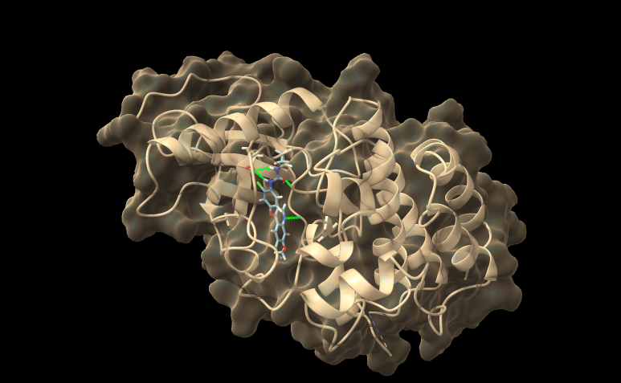

#+setupfile: ~/.emacs.d/latex.org
#+title: Lab 11 Molecular Docking

* Testing 
There are 4 Hydrogen bonds between the ligand and the protein

| SMALL Residue    | Ligand Atom | Distance (A) |
|------------------+-------------+--------------|
| Alanine 102      | N1          |        2.097 |
| Aspartine 165    | O4          |        2.210 |
| Glutamine 69 OE2 | H9          |        2.413 |
| Glutamine 69 OE2 | H8          |        2.188 |

| Descriptor                    |      Value | Descriptor                    |      Value |
|-------------------------------+------------+-------------------------------+------------|
| Continuous Score              | -61.017719 | desc VOS Hydrophilic atm vo   |        1.0 |
| desc Continuous es energy     |   -6.67997 | desc VOS hydrophobic atm vo   |        1.0 |
| desc Continuous vdw energy    | -54.337749 | desc VOS neg chrg atm vo      |   0.791001 |
| desc FPS es energy            |  -6.679937 | desc VOS pos chrg atm vo      |   0.822563 |
| desc FPS es fp numres         |        284 | Descriptor Score              | -58.773136 |
| desc FPS es fps               |   2.244584 | DOCK Rotatable Bonds          |          9 |
| desc FPS hb fp numres         |        284 | Footprint Similarity Score    |   2.244584 |
| desc FPS num hbond            |          4 | H-Bonds                       |          4 |
| desc FPS vdw energy           | -54.365158 | HBond Acceptors               |          9 |
| desc FPS vdw fp numres        |        284 | HBond Donors                  |          4 |
| desc FPS vdw fps              |        0.0 | Heavy Atoms                   |         30 |
| desc FPS vdw+es energy        | -61.045097 | Hungarian Matching Similarity |       -5.0 |
| desc HMS num ref hvy atms     |         30 | Internal energy repulsive     |  13.165473 |
| desc HMS num unmtchd hvy atms |          0 | Molecular Weight              |    426.859 |
| desc HMS rmsd mtchd hvy atms  |        0.0 | Name                          |   5ZV2.lig |
| desc VOS geometric vo         |        1.0 | Property Volume Score         |   0.935594 |
| desc VOS hvy atom vo          |        1.0 | Rating                        |  (unrated) |

* Cartmin

** Molecule Selection Strategy

I initially filtered molecules based on multiple scoring metrics from DOCK6, prioritizing those with favorable energetic and geometric properties. Specifically, I selected molecules with:

- Continuous Score < -55 (strong binding energy)
- Footprint Similarity Score > 12.5 (similar interaction pattern to reference ligand)
- Hungarian Matching Similarity Score < 1.5 (good structural alignment)
- Property Volume Score > 0.55 (appropriate steric fit)

Additionally, I required that all selected molecules form hydrogen bonds with key residues in the binding pocket, particularly Aspartate 165, Glutamine 69, and Alanine 102. After filtering, I manually inspected the remaining molecules to ensure consistent orientation and reasonable binding poses.

| Ligand ID    | SMILES                                                        |
|--------------+---------------------------------------------------------------|
| ZINC15726433 | CCNC(=O)[C@H]1CC[N@H+](Cc2nc(c3ccc(OC)c(OC)c3)no2)CC1         |
| ZINC32891679 | C[C@@H](c1cccc(NC(=O)c2ccccc2)c1)N(C)C(=O)CCn1c(=O)oc2ccccc21 |
| ZINC44308404 | CCCNC(=O)C[N@H+]1CC[C@H](NC(=O)Nc2ccc3oc(C4CC4)nc3c2)CC1      |
| ZINC90883402 | C[C@H]([NH2+]Cc1ccc(-c2ccc3c(c2)C[C@@H](C)O3)cc1)c1cnn(C)c1   |
| ZINC33310196 | CCCNC(=O)Nc1ccc(NC(=O)N2CCC(C(=O)NCC3CC3)CC2)cc1              |
| ZINC23338973 | COc1cccc(-c2cccc(N3CCC([NH2+]CC[C@H]4CC(=O)N(C)C4)CC3)c2)c1   |
| ZINC08428037 | COc1ccc(NC(=O)c2ccc(C[N@H+](C)Cc3ccccc3F)cc2)cc1              |
| ZINC12447200 | CCn1ccnc1CNc1ccc(-c2nc(-c3ccccc3F)no2)c[nH+]1                 |
| ZINC64719881 | O=C(CCCn1c(=O)oc2ccccc21)NCCC1=c2ccccc2=[NH+]C1               |
| ZINC48355563 | O=C([O-])c1ccn(-c2ccc(NS(=O)(=O)c3ccc(N4CCCC4=O)cc3)cc2)n1    |
| ZINC73306518 | C[NH+](C)CC(=O)Nc1ccc(NC(=O)c2ccc(-n3ccnc3)nc2)cc1            |
| ZINC89773358 | C[NH+](C)CC(=O)Nc1ccc(NC(=O)c2ccc(-n3ccnn3)cc2)cc1            |
| ZINC72412269 | COc1ccc(OC[C@H]2CC[N@H+](C[C@]3(O)CCC[NH2+]C3)CC2)cc1         |
| ZINC01351668 | O=C(Nc1ccc(C[NH+]2CCCCC2)cc1)c1cc2ccccc2oc1=O                 |
| ZINC29323279 | O=C(NCc1ccc(N2CCCC2)[nH+]c1)NCc1ccc2c(c1)OCCO2                |

These are organized in decreasing Continuous Scoring binding.

~yaml_generator.py~
#+begin_src python :eval no :exports code 
  import os

  protein_seq = "YELPEDPRWELPRDRLVLGKPLGEGAFGQVVLAEAIGLDKDKPNRVTKVAVKMLKSDATEKDLSDLISEMEMMKMIGKHKNIINLLGACTQDGPLYVIVEYASKGNLREYLQARRPEQLSSKDLVSCAYQVARGMEYLASKKCIHRDLAARNVLVTEDNVMKIADFGLARDHIDYYKKTTNGRLPVKWMAPEALFDRIYTHQSDVWSFGVLLWEIFTLGGSPYPGVPVEELFKLLKEGHRMDKPSNCTNELYMMMRDCWHAVPSQRPTFKQLVEDLDRIVALTS"

  # Full ligand table (deduplicated ZINC72412269)
  ligands = {
      "ZINC15726433": "CCNC(=O)[C@H]1CC[N@H+](Cc2nc(c3ccc(OC)c(OC)c3)no2)CC1",
      "ZINC32891679": "C[C@@H](c1cccc(NC(=O)c2ccccc2)c1)N(C)C(=O)CCn1c(=O)oc2ccccc21",
      "ZINC44308404": "CCCNC(=O)C[N@H+]1CC[C@H](NC(=O)Nc2ccc3oc(C4CC4)nc3c2)CC1",
      "ZINC90883402": "C[C@H]([NH2+]Cc1ccc(-c2ccc3c(c2)C[C@@H](C)O3)cc1)c1cnn(C)c1",
      "ZINC33310196": "CCCNC(=O)Nc1ccc(NC(=O)N2CCC(C(=O)NCC3CC3)CC2)cc1",
      "ZINC23338973": "COc1cccc(-c2cccc(N3CCC([NH2+]CC[C@H]4CC(=O)N(C)C4)CC3)c2)c1",
      "ZINC08428037": "COc1ccc(NC(=O)c2ccc(C[N@H+](C)Cc3ccccc3F)cc2)cc1",
      "ZINC12447200": "CCn1ccnc1CNc1ccc(-c2nc(-c3ccccc3F)no2)c[nH+]1",
      "ZINC64719881": "O=C(CCCn1c(=O)oc2ccccc21)NCCC1=c2ccccc2=[NH+]C1",
      "ZINC48355563": "O=C([O-])c1ccn(-c2ccc(NS(=O)(=O)c3ccc(N4CCCC4=O)cc3)cc2)n1",
      "ZINC73306518": "C[NH+](C)CC(=O)Nc1ccc(NC(=O)c2ccc(-n3ccnc3)nc2)cc1",
      "ZINC89773358": "C[NH+](C)CC(=O)Nc1ccc(NC(=O)c2ccc(-n3ccnn3)cc2)cc1",
      "ZINC72412269": "COc1ccc(OC[C@H]2CC[N@H+](C[C@]3(O)CCC[NH2+]C3)CC2)cc1",
      "ZINC01351668": "O=C(Nc1ccc(C[NH+]2CCCCC2)cc1)c1cc2ccccc2oc1=O",
      "ZINC29323279": "O=C(NCc1ccc(N2CCCC2)[nH+]c1)NCc1ccc2c(c1)OCCO2"
  }

  os.makedirs("boltz_yaml_fixed", exist_ok=True)

  # EXACT template you confirmed works
  template = """sequences:
  - protein:
      id: A
      sequence: {protein}
  - ligand:
      id: B
      smiles: '{smiles}'
  properties:
  - affinity:
      binder: B
  """

  for lig, smi in ligands.items():
      yaml_text = template.format(
	  protein=protein_seq,
	  smiles=smi
      )

      out_file = f"boltz_yaml_fixed/boltz_{lig}.yaml"
      with open(out_file, "w") as f:
	  f.write(yaml_text)

      print(f"Wrote {out_file}")

  print("\nDone: all YAML files generated.")  
#+end_src

#+begin_src bash
  python yaml_generator.py
  for f in boltz_yaml_fixed/*.yaml; do     boltz predict "$f" --use_msa_server; done
#+end_src

| Ligand ID    | Pruned RMSD (Å) | Full RMSD (Å) | Alignment Score |
|--------------+-----------------+---------------+-----------------|
| ZINC01351668 |           0.598 |         1.140 |          1440.9 |
| ZINC08428037 |           0.549 |         1.411 |          1438.8 |
| ZINC12447200 |           0.657 |         0.996 |          1452.0 |
| ZINC15726433 |           0.547 |         0.931 |          1452.6 |
| ZINC23338973 |           0.714 |         1.177 |          1444.8 |
| ZINC29323279 |           0.489 |         1.141 |          1438.8 |
| ZINC32891679 |           0.437 |         1.109 |          1444.8 |
| ZINC33310196 |           0.664 |         0.988 |          1443.9 |
| ZINC44308404 |           0.539 |         1.125 |          1440.9 |
| ZINC48355563 |           0.507 |         1.124 |          1444.8 |
| ZINC64719881 |           0.507 |         1.177 |          1438.8 |
| ZINC72412269 |           0.646 |         1.204 |          1444.8 |
| ZINC73306518 |           0.810 |         1.242 |          1440.9 |
| ZINC89773358 |           0.747 |         1.239 |          1438.8 |
| ZINC90883402 |           0.613 |         1.157 |          1440.9 |

| Ligand (ZINC ID)     | Affinity pred value | Confidence |
|----------------------|---------------------+------------|
| ZINC08428037         | 1.626               | 0.154      |
| ZINC64719881         | 1.081               | 0.120      |
| ZINC48355563         | 1.002               | 0.209      |
| ZINC32891679         | 0.961               | 0.103      |
| ZINC15726433         | 0.819               | 0.061      |
| ZINC29323279         | 0.661               | 0.115      |
| ZINC12447200         | 0.648               | 0.163      |
| ZINC89773358         | 0.621               | 0.191      |
| ZINC01351668         | 0.506               | 0.245      |
| ZINC73306518         | 0.267               | 0.250      |
| ZINC72412269         | 0.262               | 0.026      |
| ZINC90883402         | 0.207               | 0.236      |
| ZINC23338973         | 0.166               | 0.102      |
| ZINC44308404         | 0.147               | 0.098      |
| ZINC33310196         | 0.140               | 0.109      |

** Scaling Considerations

At larger scales, such as millions of compounds, brute-force docking becomes computationally infeasible. Several strategies could improve tractability:

- Pre-filtering using physicochemical properties (e.g., Lipinski’s rules)
- Machine learning models to predict binding likelihood before docking
- Clustering compounds and selecting representatives
- Using approximate or coarse-grained docking for initial screening
- Parallelization across GPUs or distributed systems

** Continuous Scoring vs BoltzGen Affinity Comparison
The ranking produced by Boltz-2 shows only partial agreement with the Continuous Scoring results. While some ligands such as ZINC32891679 maintain relatively high ranking in both methods, the top-ranked compound from Continuous Scoring (ZINC15726433) is not the top performer in Boltz-2 predictions.

Instead, Boltz-2 identifies ZINC08428037 and ZINC64719881 as stronger binders, suggesting that physics-informed structural modeling captures additional binding effects not reflected in the docking-based Continuous Score.

This discrepancy highlights the difference between static scoring functions and learned structural affinity predictors, where Boltz-2 incorporates more nuanced interaction geometry and protein flexibility.

** DOCK6 Rigidity
Rigid docking methods like DOCK6 are useful for high-throughput screening because they are fast, reproducible, and allow many ligands to be ranked against a fixed protein structure. However, the assumption that the protein remains rigid is a major limitation, since real proteins often undergo conformational changes upon ligand binding, including side-chain rearrangements and backbone adjustments (induced fit). This means that rigid docking can miss important interactions or produce inaccurate binding poses compared to more flexible approaches like Boltz-2 or crystallographic structures. Additional limitations include simplified scoring functions that only approximate binding energetics, poor treatment of solvent and water-mediated interactions, and the assumption of a single dominant binding pose. While addressing these issues with flexible docking, molecular dynamics, or ensemble approaches would improve physical accuracy, it would also significantly increase computational cost and reduce scalability. As a result, rigid docking remains useful as an initial screening tool, but it is not sufficient on its own for reliable prediction of binding affinity or precise structural modeling.
