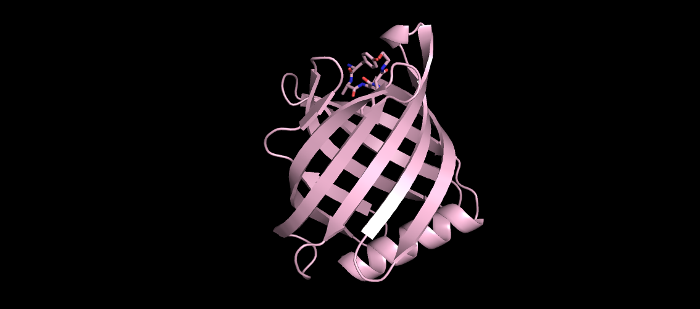
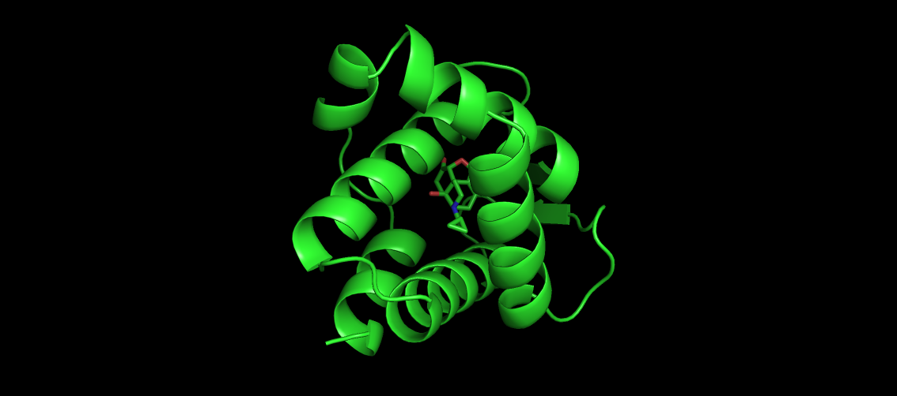
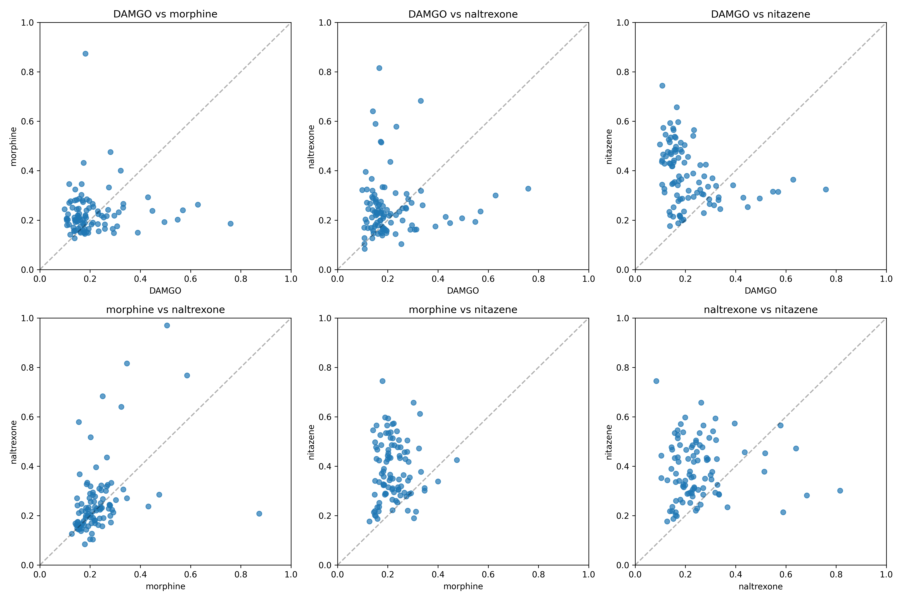

#+setupfile: ~/.emacs.d/latex.org
#+title: Lab 12 Binder Design

\newpage
* Boltzgen
First I created the DAMGO ~spec.yaml~ file since it didn't exist. I found the SMILES from Wikipedia, then ran the following code for each of ~DAMGO~, ~morphine~, ~naltrexone~, and ~nitazene~.

#+begin_src bash
boltzgen run "intermediate/$RUN_ID/spec.yaml" \
  --output "$LAB_PATH/intermediate/$RUN_ID/merged/task-outputs" \
  --num_designs 5 \
  --protocol protein-small_molecule \
  --cache $LAB_PATH/.cache \
  --reuse
#+end_src

\newpage
* Inspection
** Overview of filtering behavior across all targets
Across DAMGO, morphine, naltrexone, and nitazene, the pipeline is consistently dominated by structural RMSD-based filters:

- filter rmsd \leq 2.5 \text{\AA}
- filter rmsd design \leq 2.5 \text{\AA}
- designfolding-filter rmsd \leq 2.5 \text{\AA}

These are the primary gating constraints determining whether a design survives.

Secondary sequence composition filters (ALA/GLY/GLU/LEU/VAL fractions) are weak and rarely binding across all targets.

** Yield and filtering efficiency

| Target       | Generated | Passing all filters | Pass rate |
|--------------+-----------+---------------------+----------|
| DAMGO        | 20,000    | 11,234              | ~56%     |
| Morphine     | 20,000    | 11,234              | ~56%     |
| Naltrexone   | 18,839    | 12,442              | ~66%     |
| Nitazene     | 33,465    | 26,098              | ~78%     |

Key observation:
- Nitazene is the easiest target structurally (highest survival rate).
- DAMGO and morphine are the most constrained.
- Naltrexone is intermediate but still relatively permissive.

** Binding quality comparison

Primary metric: design to target iptm

| Target       | Top-set mean |
|--------------+-------------|
| DAMGO        | ~0.75       |
| Morphine     | ~0.80       |
| Naltrexone   | ~0.80+      |
| Nitazene     | ~0.79–0.80  |

Interpretation:
- Morphine and naltrexone remain the strongest overall binders.
- Nitazene is comparable to naltrexone in predicted binding confidence.
- DAMGO is consistently the weakest in binding geometry quality.

** Structural confidence (PAE)

Lower is better:

| Target       | Mean top-set PAE |
|--------------+------------------|
| DAMGO        | ~2.14            |
| Morphine     | ~2.10            |
| Naltrexone   | ~2.10            |
| Nitazene     | ~1.76–1.92       |

Key observation:
- Nitazene shows the lowest PAE overall, indicating the most confident structural predictions.
- DAMGO remains the least confident among the four.

** Interaction profile differences

Hydrogen bonding and salt bridges:

- Morphine:
  - Highest hydrogen bond counts among earlier targets
  - Strong interaction density

- Nitazene:
  - Moderate-to-high hydrogen bonding (~2–2.4 in selected sets)
  - Slightly improved salt bridge signal vs earlier targets

- DAMGO:
  - Weakest and most variable interaction pattern

- Naltrexone:
  - Moderate interactions, strong structural stability

General trend:
- Interaction richness does not always correlate with ipTM; nitazene improves structural confidence more than interaction density.

** Hydrophobic and burial signal

- $\delta$ SASA is consistently strong across all targets (~400–500 range)
- Nitazene and naltrexone show slightly higher mean burial in selected sets
- DAMGO shows more variability and weaker clustering

** Diversity behavior (important systemic observation)

Across all four targets:

- Diversity parameter \alpha = 0.001
- Effectively produces:
  - ~100% quality-driven selection
  - minimal sequence diversity in final 30 sets

Consequences:
- Strong clustering in num design distributions
- Overlap between “top-quality” and “diverse” sets
- Final sets are highly redundant structurally

** Overall comparison across targets

Difficulty ranking (hard → easy):

1. DAMGO (hardest)
   - lowest ipTM
   - weakest interaction signal
   - highest variability

2. Morphine
   - strongest interaction chemistry
   - high structural confidence

3. Naltrexone
   - best balance of stability + confidence
   - consistently low PAE

4. Nitazene (easiest structurally)
   - highest pass rate (~78%)
   - lowest PAE overall
   - strong structural convergence

** Key takeaways

- RMSD-based structural filters dominate selection across all targets.
- Nitazene is the most structurally “designable” target in this pipeline.
- Morphine and naltrexone yield the highest-quality binding predictions.
- DAMGO remains the most challenging target across all metrics.
- Final selected sets are high-confidence but strongly redundant due to near-zero diversity pressure.

** Conclusion

Across all ligands:

- DAMGO → high RMSD failure rate
- Morphine → moderate improvement but still unstable
- Naltrexone → strong structural consistency
- Nitazene → best or near-best overall metrics

RMSD-based structural filtering is the dominant constraint across all runs.

\newpage
* PyMOL
Inside the PyMOL terminal, I did the following
#+begin_src text
cd ~/lab12/intermediate/$RUNID/merged/final_ranked_designs/final_30_designs/
#+end_src
** DAMGO
#+begin_src text
PyMOL>extra_fit resn LIG1
rank00002_task-26768452-18_spec_135 RMSD =    2.395 (31 atoms)
rank00003_task-26768452-7_spec_151 RMSD =    2.708 (35 atoms)
rank00004_task-26768452-3_spec_892 RMSD =    2.530 (32 atoms)
rank00005_task-26768452-4_spec_171 RMSD =    2.635 (30 atoms)
rank00006_task-26768452-3_spec_632 RMSD =    2.550 (37 atoms)
rank00007_task-26768452-20_spec_068 RMSD =    2.109 (35 atoms)
rank00008_task-26768452-5_spec_635 RMSD =    3.529 (37 atoms)
rank00009_task-26768452-16_spec_431 RMSD =    2.107 (29 atoms)
rank00010_task-26768452-12_spec_749 RMSD =    3.226 (36 atoms)
rank00011_task-26768452-9_spec_299 RMSD =    2.462 (36 atoms)
rank00012_task-26768452-20_spec_599 RMSD =    3.070 (37 atoms)
rank00013_task-26768452-14_spec_283 RMSD =    1.912 (29 atoms)
rank00014_task-26768452-14_spec_846 RMSD =    3.214 (37 atoms)
rank00015_task-26768452-13_spec_293 RMSD =    2.850 (37 atoms)
rank00016_task-26768452-20_spec_024 RMSD =    2.431 (37 atoms)
rank00017_task-26768452-13_spec_521 RMSD =    2.088 (30 atoms)
rank00018_task-26768452-8_spec_905 RMSD =    2.409 (30 atoms)
rank00019_task-26768452-12_spec_980 RMSD =    1.812 (37 atoms)
rank00020_task-26768452-12_spec_373 RMSD =    0.852 (27 atoms)
rank00021_task-26768452-4_spec_098 RMSD =    1.335 (28 atoms)
rank00022_task-26768452-17_spec_839 RMSD =    1.858 (29 atoms)
rank00023_task-26768452-18_spec_461 RMSD =    1.654 (30 atoms)
rank00024_task-26768452-17_spec_416 RMSD =    2.900 (36 atoms)
rank00025_task-26768452-6_spec_900 RMSD =    2.636 (30 atoms)
rank00026_task-26768452-7_spec_156 RMSD =    1.975 (33 atoms)
rank00028_task-26768452-3_spec_406 RMSD =    2.132 (37 atoms)
rank00029_task-26768452-10_spec_295 RMSD =    2.624 (34 atoms)
rank00030_task-26768452-8_spec_682 RMSD =    2.070 (34 atoms)
rank00031_task-26768452-14_spec_033 RMSD =    4.286 (37 atoms)
#+end_src

The best scoring proteins all had \alpha helices, but the ligand was all on the outside. I found ~rank00022~ to be the most interesting.

A lot of the ~BLASTP~ results for ~DAMGO~ had no results. The ones that did showed similarity with tyrosine protein kinase, among very different species ranging from bacteria to aquatic and land eukaryotes. 
While the ~BLASTP~ did not show anything for rank 22, some hits from FoldSeek varied a lot from serine protein kinases to transmembrane proteins.

** Morphine
#+begin_src text
PyMOL>extra_fit resn LIG1
rank00002_task-26767312-1_spec_141 RMSD =    0.077 (18 atoms)
rank00003_task-26767312-10_spec_040 RMSD =    0.132 (17 atoms)
rank00004_task-26767312-16_spec_612 RMSD =    0.100 (17 atoms)
rank00005_task-26767312-10_spec_952 RMSD =    1.953 (21 atoms)
rank00006_task-26767312-18_spec_121 RMSD =    0.182 (21 atoms)
rank00007_task-26767312-5_spec_482 RMSD =    0.177 (21 atoms)
rank00008_task-26767312-4_spec_364 RMSD =    0.126 (20 atoms)
rank00009_task-26767312-4_spec_224 RMSD =    0.183 (19 atoms)
rank00010_task-26767312-4_spec_886 RMSD =    1.920 (21 atoms)
rank00011_task-26767312-14_spec_784 RMSD =    0.141 (21 atoms)
rank00012_task-26767312-1_spec_188 RMSD =    1.866 (21 atoms)
rank00013_task-26767312-13_spec_088 RMSD =    1.984 (21 atoms)
rank00014_task-26767312-2_spec_096 RMSD =    1.907 (21 atoms)
rank00015_task-26767312-7_spec_002 RMSD =    1.968 (21 atoms)
rank00016_task-26767312-10_spec_713 RMSD =    1.886 (21 atoms)
rank00017_task-26767312-1_spec_599 RMSD =    1.924 (21 atoms)
rank00018_task-26767312-19_spec_164 RMSD =    0.211 (20 atoms)
rank00019_task-26767312-11_spec_571 RMSD =    1.967 (21 atoms)
rank00020_task-26767312-1_spec_709 RMSD =    1.953 (21 atoms)
rank00021_task-26767312-19_spec_235 RMSD =    1.979 (21 atoms)
rank00022_task-26767312-5_spec_154 RMSD =    1.931 (21 atoms)
rank00023_task-26767312-11_spec_906 RMSD =    1.942 (21 atoms)
rank00024_task-26767312-11_spec_116 RMSD =    1.969 (21 atoms)
rank00025_task-26767312-20_spec_632 RMSD =    0.097 (17 atoms)
rank00026_task-26767312-6_spec_106 RMSD =    0.129 (20 atoms)
rank00027_task-26767312-17_spec_587 RMSD =    1.967 (21 atoms)
rank00028_task-26767312-20_spec_505 RMSD =    1.890 (21 atoms)
rank00030_task-26767312-9_spec_841 RMSD =    1.815 (21 atoms)
rank00031_task-26767312-13_spec_833 RMSD =    0.129 (20 atoms)
#+end_src

The Morphine design set shows a much tighter convergence compared to DAMGO, with a clear bimodal distribution of ligand-aligned RMSDs. A large subset of structures clusters very tightly (~0.07–0.21 Å), indicating an almost identical ligand pose across these designs, while a second major group lies around ~1.8–2.0 Å, suggesting an alternative but still structurally related binding mode.

All of these proteins formed a \beta barrel around the ligand. This is rank00011 which was the most intriguing for me. 

BLASTP results have a lot fewer hits, but the designs that do have a match are ubiquitin protein ligase Mdm2 like. 
FoldSEEK also indicates that this is a peroxynitrate isomerase.

** Naltrexone
#+begin_src text
PyMOL>extra_fit resn LIG1
rank00002_task-26767580-1_spec_784 RMSD =    0.156 (19 atoms)
rank00003_task-26767580-16_spec_216 RMSD =    2.004 (25 atoms)
rank00004_task-26767580-2_spec_046 RMSD =    0.095 (18 atoms)
rank00005_task-26767580-9_spec_475 RMSD =    0.144 (21 atoms)
rank00006_task-26767580-10_spec_616 RMSD =    0.147 (20 atoms)
rank00007_task-26767580-17_spec_107 RMSD =    0.104 (18 atoms)
rank00008_task-26767580-5_spec_040 RMSD =    1.971 (25 atoms)
rank00009_task-26767580-14_spec_228 RMSD =    0.102 (19 atoms)
rank00010_task-26767580-13_spec_116 RMSD =    2.013 (25 atoms)
rank00011_task-26767580-10_spec_962 RMSD =    0.103 (18 atoms)
rank00012_task-26767580-8_spec_339 RMSD =    0.132 (20 atoms)
rank00013_task-26767580-12_spec_279 RMSD =    0.090 (18 atoms)
rank00014_task-26767580-8_spec_132 RMSD =    2.024 (25 atoms)
rank00015_task-26767580-16_spec_186 RMSD =    0.135 (19 atoms)
rank00016_task-26767580-8_spec_528 RMSD =    0.093 (19 atoms)
rank00017_task-26767580-3_spec_316 RMSD =    1.853 (25 atoms)
rank00018_task-26767580-7_spec_258 RMSD =    0.132 (20 atoms)
rank00019_task-26767580-17_spec_128 RMSD =    1.892 (25 atoms)
rank00020_task-26767580-3_spec_029 RMSD =    1.732 (24 atoms)
rank00021_task-26767580-15_spec_322 RMSD =    0.121 (18 atoms)
rank00022_task-26767580-4_spec_448 RMSD =    0.125 (19 atoms)
rank00023_task-26767580-12_spec_152 RMSD =    0.153 (18 atoms)
rank00024_task-26767580-6_spec_285 RMSD =    0.186 (18 atoms)
rank00025_task-26767580-17_spec_858 RMSD =    0.095 (18 atoms)
rank00026_task-26767580-15_spec_113 RMSD =    1.902 (25 atoms)
rank00027_task-26767580-16_spec_296 RMSD =    1.914 (25 atoms)
rank00030_task-26767580-12_spec_434 RMSD =    0.107 (17 atoms)
rank00031_task-26767580-9_spec_701 RMSD =    0.122 (18 atoms)
rank00035_task-26767580-18_spec_507 RMSD =    1.918 (25 atoms)
#+end_src

These all had the \beta barrels surrounding the ligand, similar to the morphine one. The following is rank00004.

BLASTP results show more results, and show that this is a fatty acid binding protein. 
FoldSEEK also shows this is a transmembrane emp24 domain-containing protein.

** Nitazene
#+begin_src text
PyMOL>extra_fit resn LIG1
rank00002_task-26765770-1_spec_106 RMSD =    1.804 (26 atoms)
rank00003_task-26766364-8_spec_269 RMSD =    1.466 (25 atoms)
rank00004_task-26765770-15_spec_415 RMSD =    0.243 (18 atoms)
rank00005_task-26765770-5_spec_884 RMSD =    1.019 (23 atoms)
rank00006_task-26765770-15_spec_412 RMSD =    0.729 (19 atoms)
rank00007_task-26766364-16_spec_755 RMSD =    1.972 (26 atoms)
rank00008_task-26766364-16_spec_452 RMSD =    1.250 (25 atoms)
rank00009_task-26765770-19_spec_998 RMSD =    1.930 (25 atoms)
rank00010_task-26766364-5_spec_916 RMSD =    1.918 (26 atoms)
rank00011_task-26766364-18_spec_716 RMSD =    1.831 (26 atoms)
rank00012_task-26765770-18_spec_099 RMSD =    1.922 (26 atoms)
rank00013_task-26766364-4_spec_133 RMSD =    2.029 (26 atoms)
rank00014_task-26766364-14_spec_128 RMSD =    2.147 (26 atoms)
rank00015_task-26766364-19_spec_011 RMSD =    1.300 (23 atoms)
rank00016_task-26766364-10_spec_517 RMSD =    0.988 (22 atoms)
rank00017_task-26766364-18_spec_473 RMSD =    1.902 (26 atoms)
rank00018_task-26766364-5_spec_315 RMSD =    1.012 (23 atoms)
rank00019_task-26766364-15_spec_026 RMSD =    0.915 (23 atoms)
rank00020_task-26765770-11_spec_405 RMSD =    1.845 (26 atoms)
rank00025_task-26766364-15_spec_670 RMSD =    1.803 (26 atoms)
rank00027_task-26766364-9_spec_080 RMSD =    1.490 (25 atoms)
rank00030_task-26766364-14_spec_188 RMSD =    1.738 (24 atoms)
rank00032_task-26765770-18_spec_247 RMSD =    1.193 (26 atoms)
rank00033_task-26766364-18_spec_271 RMSD =    0.277 (16 atoms)
rank00035_task-26766364-3_spec_329 RMSD =    0.112 (16 atoms)
rank00036_task-26766364-12_spec_005 RMSD =    1.483 (24 atoms)
rank00037_task-26766364-4_spec_322 RMSD =    1.792 (26 atoms)
rank00040_task-26766364-4_spec_357 RMSD =    1.893 (26 atoms)
rank00041_task-26766364-4_spec_895 RMSD =    1.719 (26 atoms)
#+end_src

Most of these had 3 or 4 \alpha helices, but there was an occasional \beta sheet and \alpha helices surrounding the ligand.
BLASTP resutls show binding proteins could also be ubiquitin Mdm2 like or bromodomain containing binders.
FoldSEEK agrees with the ubiquitin Mdm2 like interpretation. 

\newpage
* Cross Docking

There is small clustering around the diagonal, but there are a lot of points away from the diagonal.
This means binding affinity to one ligand does not reliably predict binding affinity to another. 

\newpage
* ESM Embeddings
To test this, I would first compute ESM-2 embeddings for each designed protein sequence and project them into 2D using UMAP, then color points by their intended ligand to see if designs cluster by target. In parallel, I would generate structural interaction fingerprints for each receptor–ligand complex using PLIP, summarize interaction types into feature vectors, and similarly visualize or cluster them. By comparing these plots, I would assess whether designs group by ligand specificity, whether sequence similarity corresponds to similar binding interactions, and whether distinct clusters correspond to selective versus promiscuous binders.
\newpage
