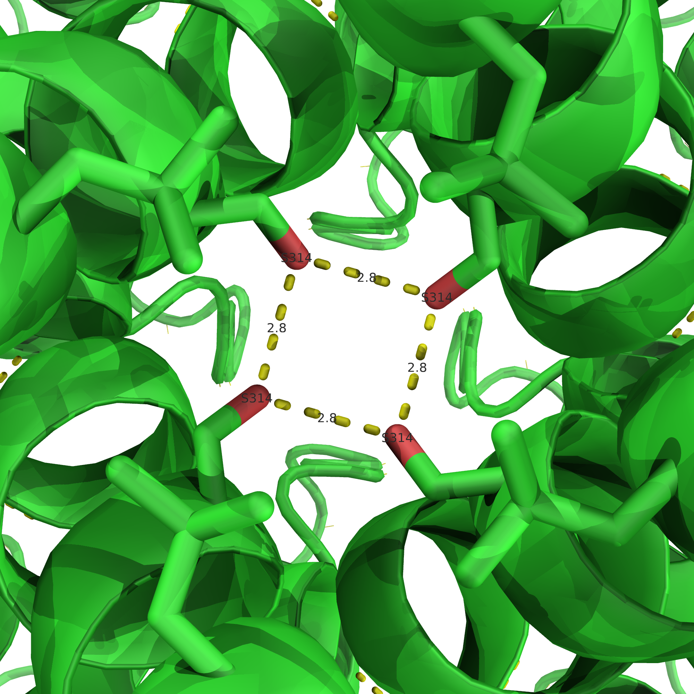
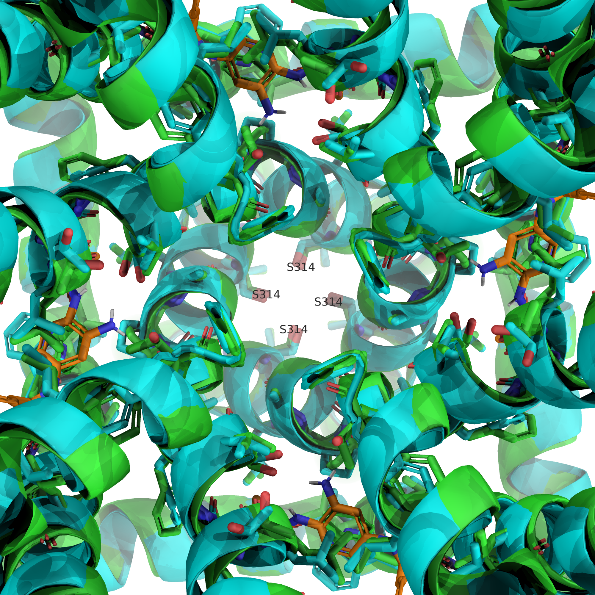
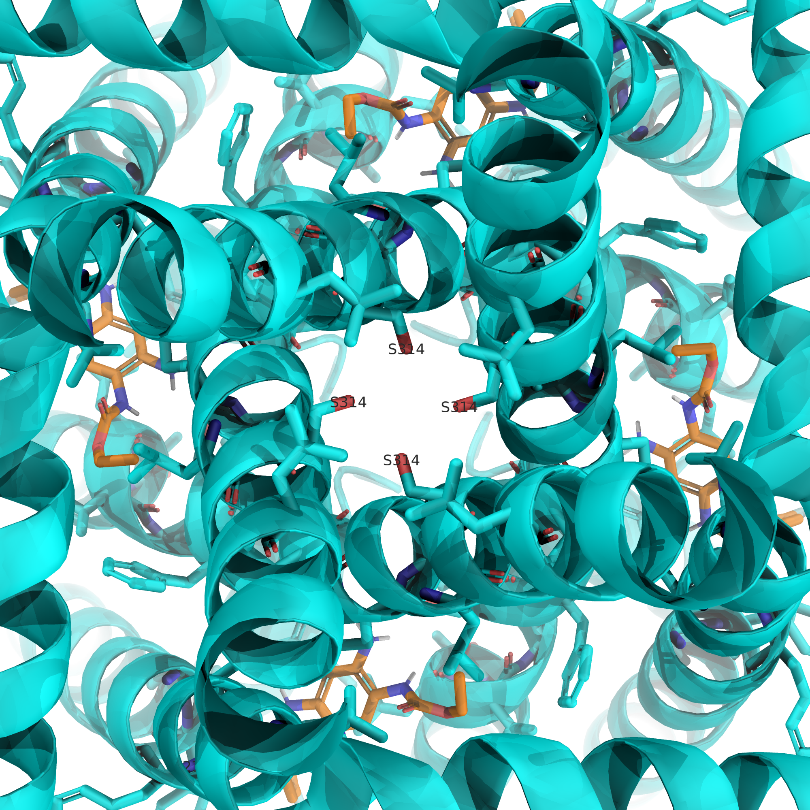

#+setupfile: ~/.emacs.d/latex.org
#+title: Lab 2 Notes
#+author: Alexander Speigle
#+property: header-args:python :session *Python* :results replace :tangle ./products/lab2.py :eval no
#+startup: indent

* GUI
** 7CR0 Measurements
There are 4 oxygens that form a square shape in the 314 residues.
/7CR0/A/A/SER 314/OG
/7CR0/B/B/SER 314/OG
/7CR0/C/C/SER 314/OG
/7CR0/D/D/SER 314/OG
The distance is 2.8 for each adjacent square. 

* CLI
#+name: imports
#+begin_src python
  import biotite.database.rcsb as rcsb
  import biotite.structure.io.pdbx as pdbx
  import biotite.structure as struc
  import numpy as np
  import pandas as pd  
#+end_src

#+name: load-cif
#+begin_src python
  pdb_ids = ["7CR2", "7CR0"]
  bcif_files = {}

  for pdb_id in pdb_ids:
    bcif_file = rcsb.fetch(pdb_id, "bcif")
    bcif_files[pdb_id] = bcif_file
    print(f"{pdb_id} downloaded, saved at {bcif_file}")
    pass
#+end_src

#+name: pdbx
#+begin_src python
  for pdb_id, bcif_path in bcif_files.items():
    bcif_file = pdbx.BinaryCIFFile.read(bcif_path)
    atom_array = pdbx.get_structure(bcif_file, model=1, include_bonds=True)
    print(f"{pdb_id} structure loaded:")
    print(atom_array)
    pass
#+end_src

#+name: ser-og-selection
#+begin_src python
  ser314_selection = (atom_array.res_id == 314) & (atom_array.res_name == "SER") & (atom_array.atom_name == "OG")
  ser314_og_coords = atom_array[ser314_selection].coord

  n = len(ser314_og_coords)

  print("S314 OG coordinates:")
  print(ser314_og_coords)
#+end_src

#+name: biotite-distance
#+begin_src python
  print("Distances between adjacent S314 OG atoms:")

  for i in range(n):
      # Next atom in sequence, wrap around for last atom to first
      j = (i + 1) % n
      d = struc.distance(ser314_og_coords[i], ser314_og_coords[j])
      print(f"Distance between atom {i} and {j}: {d:.2f} A")
      pass
#+end_src

#+name: numpy-distance
#+begin_src python
adjacent_coords = np.roll(ser314_og_coords, -1, axis=0)
distances = struc.distance(ser314_og_coords, adjacent_coords)
mean_distance = np.mean(distances)
print(f"Mean distance between adjacent S314 OG atoms: {mean_distance:.2f} A")
#+end_src

#+name: cryo-em
#+begin_src python
  df = pd.read_csv("kcnq2_cryoem.csv", skiprows=1)

  # Prepare a list to store results
  results = []

  # Iterate over each structure
  for idx, row in df.iterrows():
      entry_id = row['Entry ID']
      print(f"Processing {entry_id}...")
      
      try:
          # Fetch PDB in bcif format
          bcif_path = rcsb.fetch(entry_id, "bcif")
          
          # Read the BinaryCIF file
          bcif_file = pdbx.BinaryCIFFile.read(bcif_path)
          
          # Get structure for model=1, include bonds
          atom_array = pdbx.get_structure(bcif_file, model=1, include_bonds=True)
          
          # Select S314 OG atoms (serine gate)
          ser314_selection = (atom_array.res_id == 314) & \
                             (atom_array.res_name == "SER") & \
                             (atom_array.atom_name == "OG")
          ser314_og_coords = atom_array[ser314_selection].coord
          
          # Skip if no OG atoms found
          if len(ser314_og_coords) < 2:
              print(f"Warning: less than 2 S314 OG atoms found in {entry_id}. Skipping.")
              continue
          
          # Compute mean distance between adjacent OG atoms (wrap-around)
          adjacent_coords = np.roll(ser314_og_coords, -1, axis=0)
          distances = struc.distance(ser314_og_coords, adjacent_coords)
          mean_distance = np.mean(distances)
          
          # Store result
          results.append({"Entry ID": entry_id, "Mean S314 OG Distance (Å)": mean_distance})
      
      except Exception as e:
          print(f"Error processing {entry_id}: {e}")

  # Convert results to DataFrame
  results_df = pd.DataFrame(results)

  # Write to TSV
  results_df.to_csv("mean_gate_distances.tsv", sep="\t", index=False)

  print("Done! Results written to mean_gate_distances.tsv")
#+end_src

* Questions

The file \texttt{mean_gate_distances.tsv} contains the tabluated distance data.

The average distances I see are 2.8 angstroms in the GUI section and 2.83 angstroms for both the pdbx and numpy distance calculations from the CLI.

Retigabine is an agonist.

It needs to open the helices near the channel gate in order to bind the substrate. 

