#+setupfile: ~/.emacs.d/latex.org
#+title: Lab 5

* Code
#+begin_export latex
All code written is found in \texttt{sweep.py}, \texttt{sanitize.py}, and \texttt{residuals.py}
#+end_export

* Pipeline
#+begin_export latex
I continued using the Irwin Zinc screen dataset from the previous lab.
I did a hyperparameter grid search with different fingerprints (ecfp-count and maccs), different metrics (cosine and euclidean), different nearest neighbor counts (10 and 50), and different minimum neighbor distances (0.1, 0.25, 0.5).

Ultimately, I chose a maccs fingerprint, cosine metric, 10 nearest neighbors, and a minimum distance of 0.25 based off the small dataset.
I extrapolated to the medium and large sets as well. 
#+end_export
#+attr_latex: :width 100px
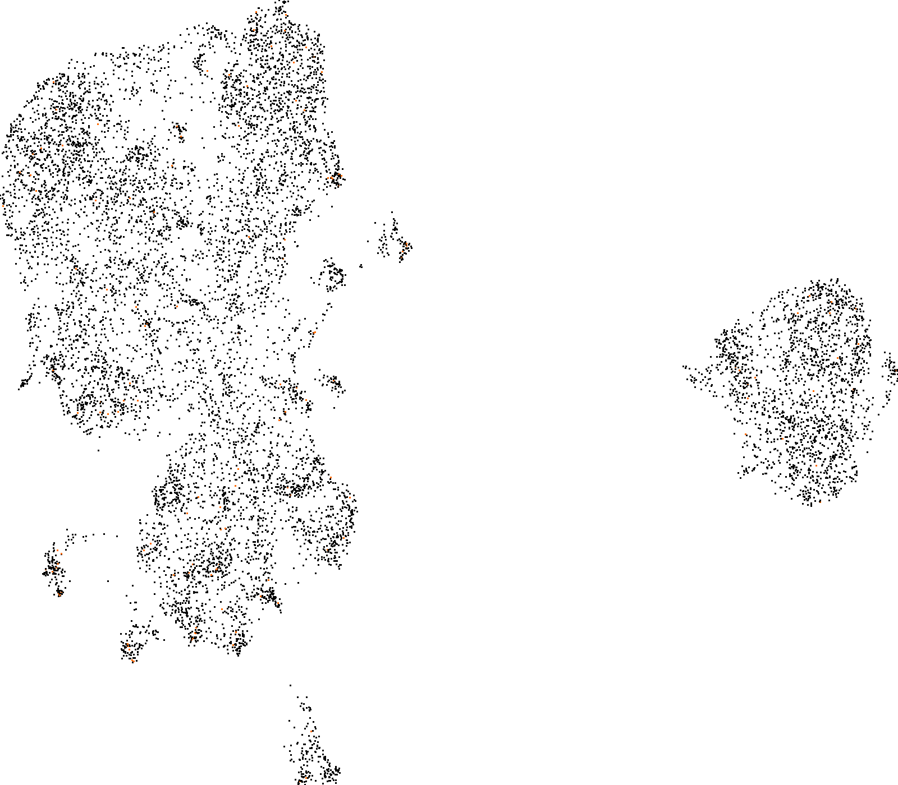
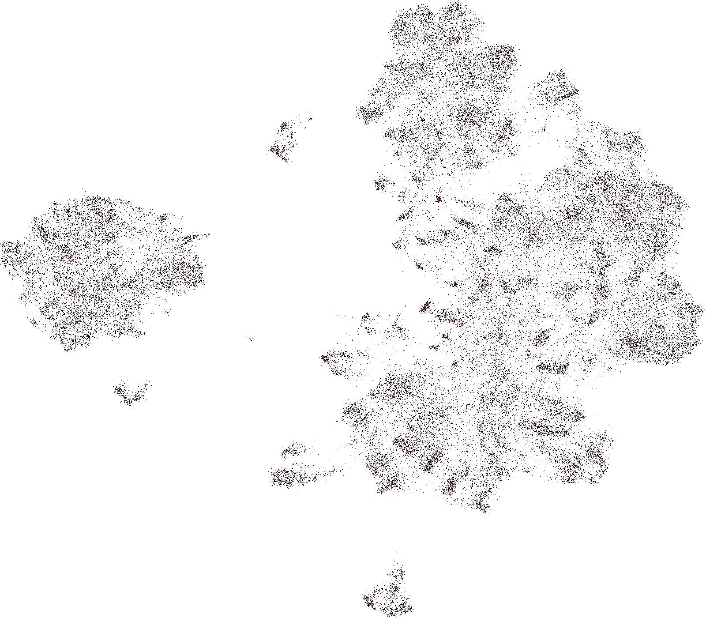
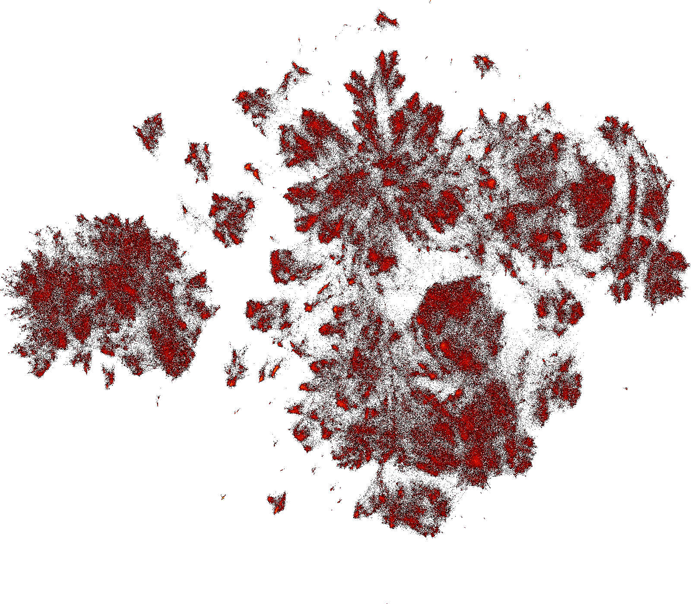
These are the small, medium, and large embedding of my choice of config values.

Another one with maccs fingerprint, euclidean metric, and 10 neighbors with minimum distance varied is

#+attr_latex: :width 100px
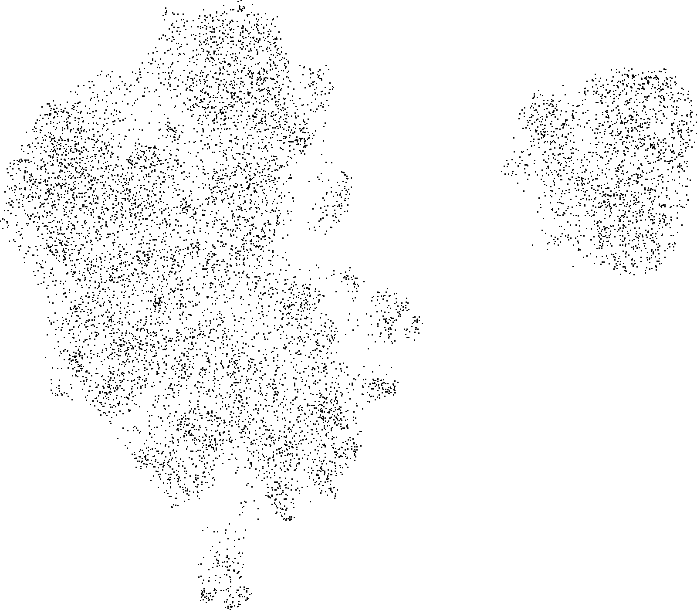
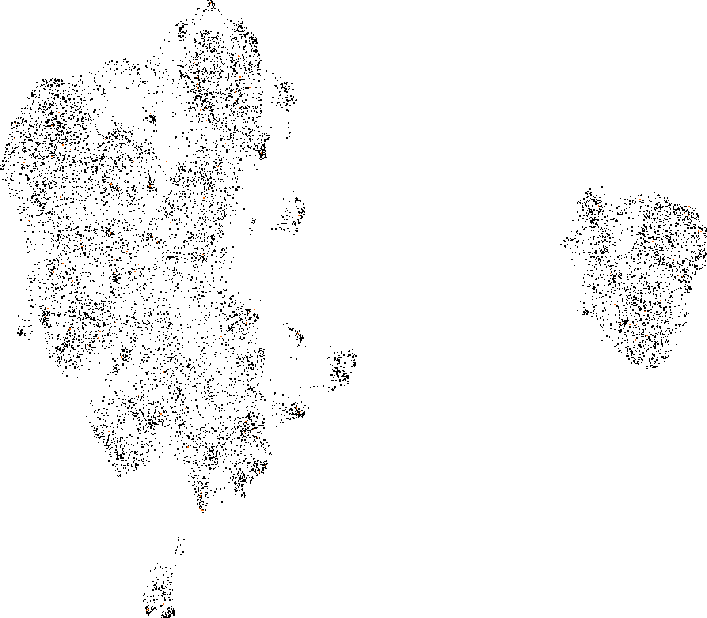
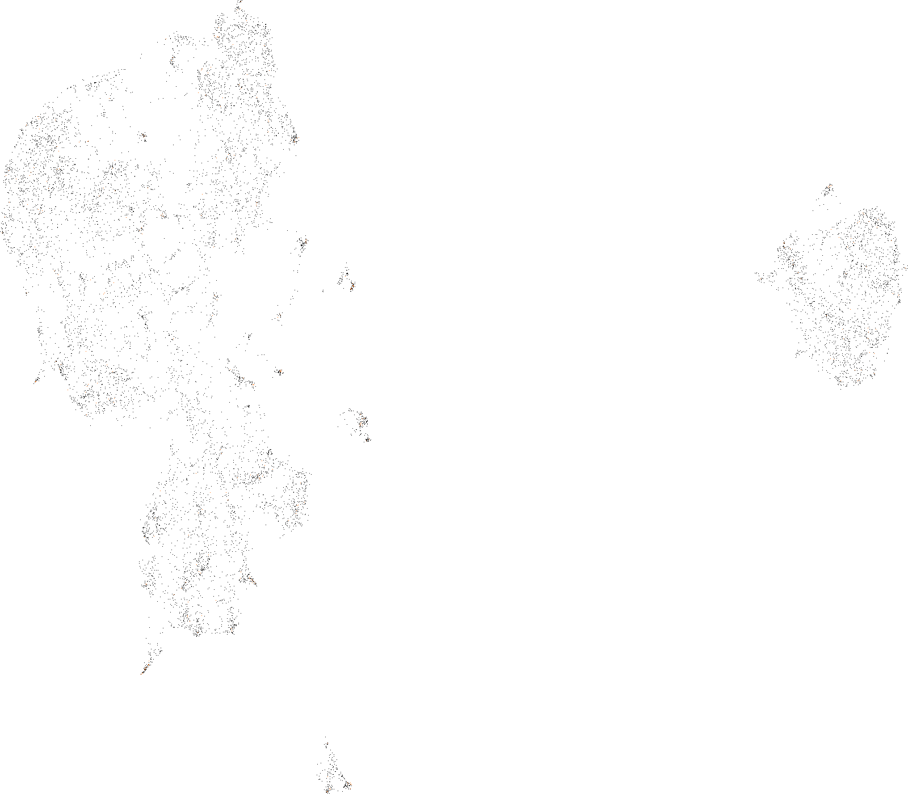
The first image is a 0.5 minimum distance, second image is 0.25 minimum distance, and third is 0.1 minimum distance. 

Decreasing the minimum distance increased the repulsion. I chose a stronger repulsion constant because I wanted to have fine chemical classes. 
I wanted to be able to determine the local similarities between molecules over defining a continuous structure.

* Residuals
The following are the predicted, true, and residual umap plots. The residuals were determine based off color pixel distances, which means the color value of the true and mean being closer to greyscale is a more accurate plot.
#+attr_latex: :width 100px

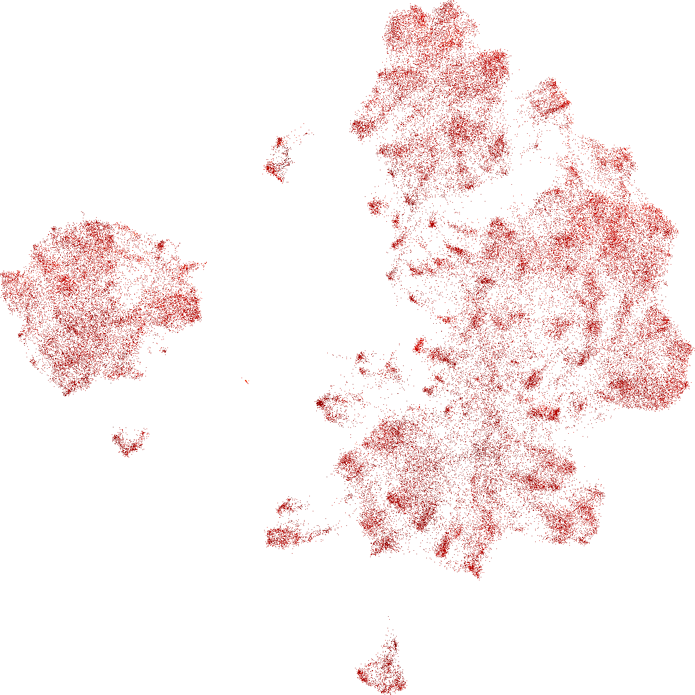
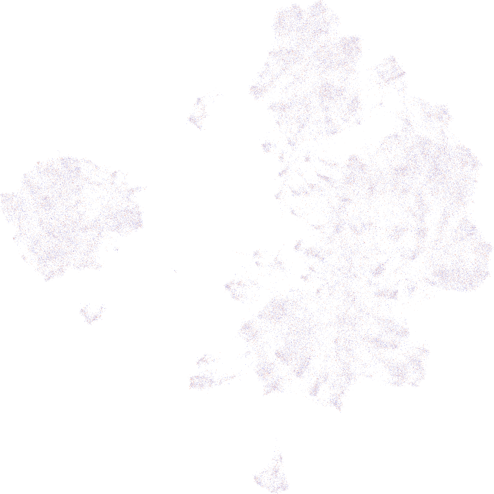
Predicted, true and residula plots for medium dataset. 

#+attr_latex: :width 100px

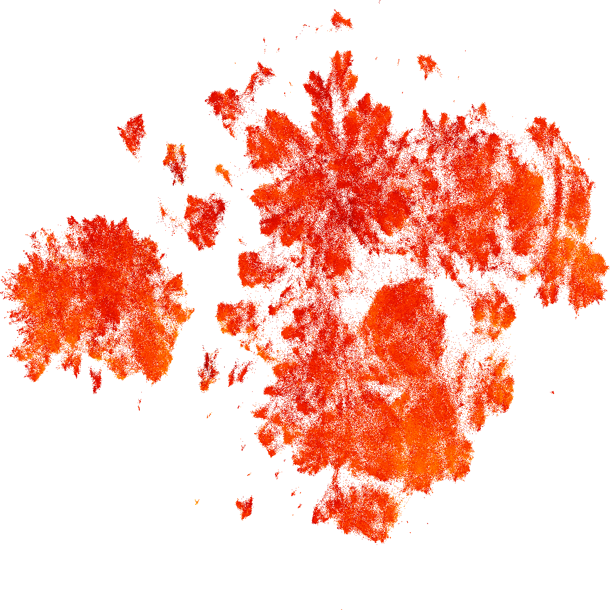
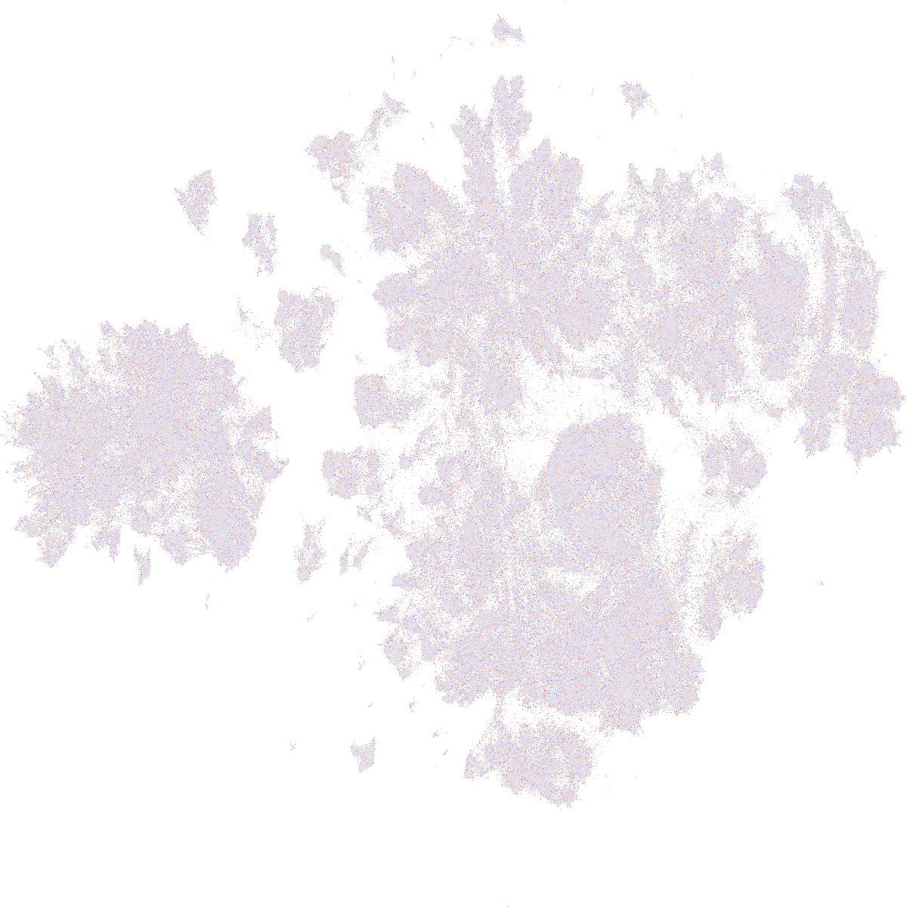
Predicted, true and residula plots for large dataset.

* Interactive Exploration
I narrowed in on a particular cluster of the medium dataset.
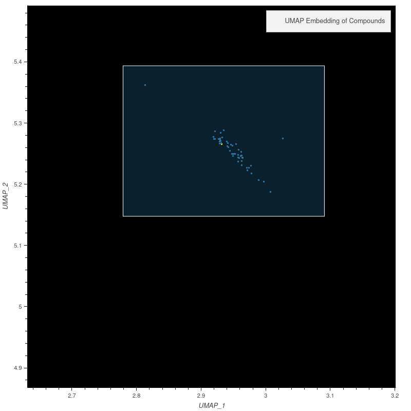
This image is from the Box edit function.

The chemicals in this class are as follows
#+attr_latex: :width 100px
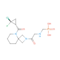
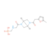
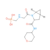
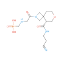
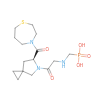
These five molecules have a score of -18.71, -30.55, -29.74, -31.46, and -29.34 respectively. 

All molecules have a carboxyl acid group attached to a NH and a double bonded O backbone. The functional groups all contain loops. 
