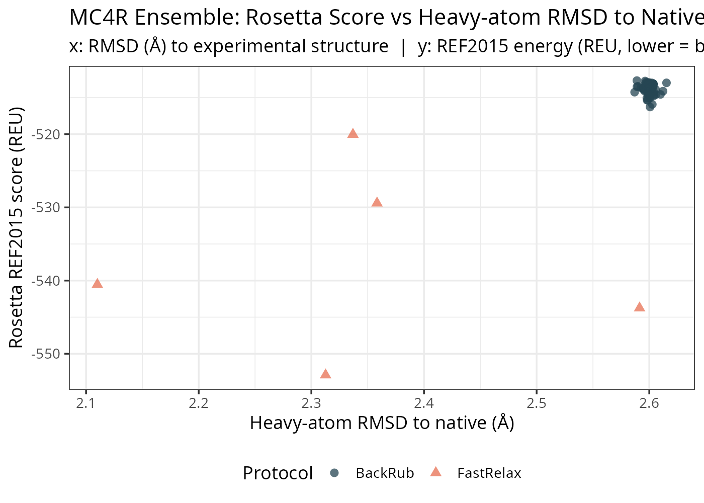
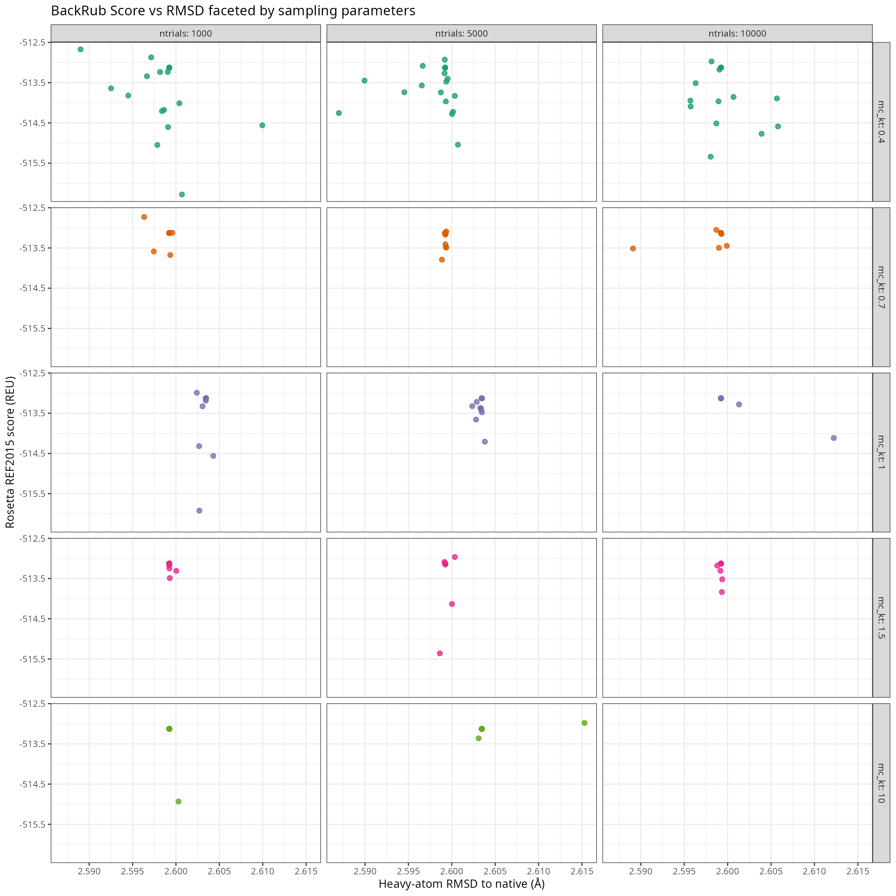
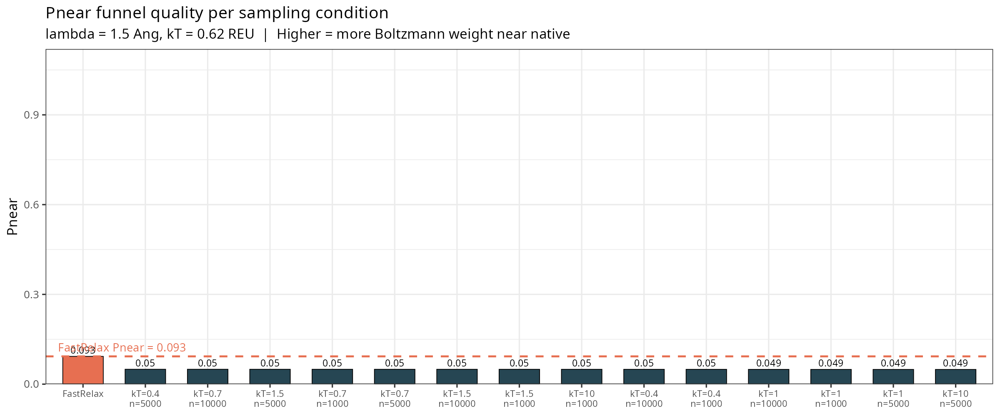
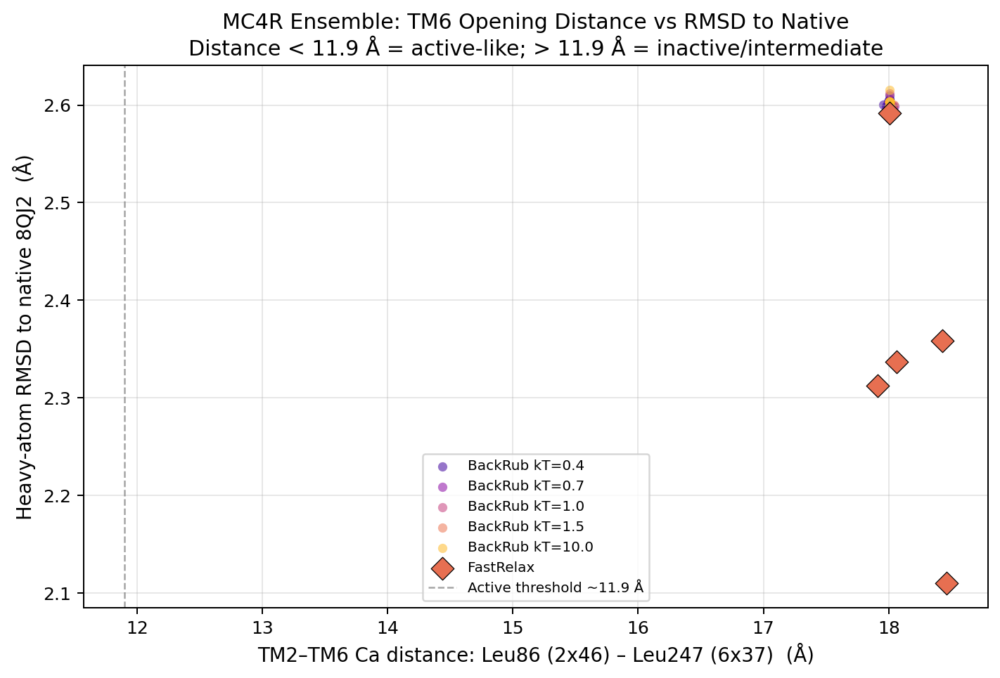

#+setupfile: ~/.emacs.d/latex.org
#+title: Lab 6
#+property: header-args:Python :session *Python* :tangle ./src/lab6.py :mkdirp yes :results none :exports none :eval no

* Description of 8QJ2
#+begin_export latex
The structure of 8QJ2 was determined via Cryo-EM. The resolution of the structure is 3.4\AA.
There is a melanocortin receptor 4 (MC4R) in the active state and an agonistic nanobody pN162 in the active state.
#+end_export

Reference: 
#+begin_example
Fontaine, T., Busch, A., Laeremans, T. et al. Structure elucidation of a human
melanocortin-4 receptor specific orthosteric nanobody agonist. Nat Commun 15,
7029 (2024). https://doi.org/10.1038/s41467-024-50827-7
#+end_example

#+begin_export latex
I expect chain A to be the MC4R section, so I run these commands in the PyMol command window. 
#+end_export
#+begin_example
hide everything
show cartoon, chain A
create mc4r_only, chain A
save MC4R.cif, mc4r_only
#+end_example
\newpage

* Experimental Structure
:PROPERTIES:
:header-args:python: :tangle src/relax.py :mkdirp yes :exports none
:END:
#+begin_src python
  import os
  import time
  import csv
  import shutil
  import pyrosetta

  pyrosetta.init("-mute all")

  # -----------------------------
  # Directory setup
  # -----------------------------
  SRC = os.path.dirname(os.path.realpath(__file__))
  ROOT = os.path.abspath(os.path.join(SRC, ".."))
  DATA = os.path.join(ROOT, "data")
  INTER = os.path.join(ROOT, "intermediates")
  RELAX_DIR = os.path.join(INTER, "relaxes")

  # Ensure base directories exist
  os.makedirs(RELAX_DIR, exist_ok=True)

  # -----------------------------
  # CLEANUP SAFETY FIX
  # Remove any accidental directories
  # that were created with .pdb names
  # -----------------------------
  for item in os.listdir(RELAX_DIR):
      full_path = os.path.join(RELAX_DIR, item)
      if item.endswith(".pdb") and os.path.isdir(full_path):
          print(f"Removing broken directory: {full_path}")
          shutil.rmtree(full_path)

  # -----------------------------
  # Load structure
  # -----------------------------
  structure_fname = os.path.join(DATA, "MC4R.cif")
  print("Loading:", structure_fname)

  pose_original = pyrosetta.rosetta.core.import_pose.pose_from_file(
      filename=structure_fname,
      read_fold_tree=False,
      type=pyrosetta.rosetta.core.import_pose.FileType.CIF_file
  )

  pose_native = pose_original.clone()

  # -----------------------------
  # Score function
  # -----------------------------
  sfxn = pyrosetta.create_score_function(weights_tag="ref2015")
  original_score = sfxn(pose_original)
  print("Native score:", original_score)

  # -----------------------------
  # FastRelax setup
  # -----------------------------
  fast_relax = pyrosetta.rosetta.protocols.relax.FastRelax(
      scorefxn_in=sfxn,
      standard_repeats=1
  )

  fast_relax.constrain_relax_to_start_coords()
  fast_relax.ramp_down_constraints(False)

  # -----------------------------
  # Sampling loop
  # -----------------------------
  nsamples = 5
  metadata = []

  for i in range(nsamples):
      print(f"\nRunning sample {i+1}/{nsamples}")

      pose_iter = pose_native.clone()

      start = time.time()
      fast_relax.apply(pose_iter)
      relax_time = time.time() - start

      relaxed_score = sfxn(pose_iter)
      rmsd = pyrosetta.rosetta.core.scoring.all_atom_rmsd(
          pose_native, pose_iter
      )
      delta_score = relaxed_score - original_score

      print(f"  Relaxed score: {relaxed_score:.2f}")
      print(f"  ΔScore: {delta_score:.2f}")
      print(f"  Heavy-atom RMSD: {rmsd:.2f} Å")
      print(f"  Relax time: {relax_time:.2f} s")

      # Correct file writing
      fname_out = os.path.join(RELAX_DIR, f"MC4R_relaxed_{i+1}.pdb")
      pose_iter.dump_pdb(fname_out)

      metadata.append([
          i + 1,
          original_score,
          relaxed_score,
          delta_score,
          rmsd,
          relax_time
      ])

  # -----------------------------
  # Save metadata
  # -----------------------------
  fname_metadata = os.path.join(RELAX_DIR, "relax_metadata.tsv")

  with open(fname_metadata, "w", newline="") as f:
      writer = csv.writer(f, delimiter="\t")
      writer.writerow([
          "sample",
          "native_score",
          "relaxed_score",
          "delta_score",
          "RMSD",
          "relax_time"
      ])
      writer.writerows(metadata)

  print("\nCompleted all relaxations.")
  print("Metadata saved to:", fname_metadata)
#+end_src

#+begin_export latex
A few of the original structures helices were protruding out in a slightly different angle than the relaxations.
This may be because the relaxations are only concerned with the default chain.
There are no interactions from other chains or environment that were present in the original structure.
#+end_export
#+attr_latex: :width \linewidth
#+name: compared-relaxes
#+caption: All five relaxed proteins demonstrated on the same PyMol representation. 
[[./intermediates/relaxes_compared.png]]

\newpage
* Backrub
:PROPERTIES:
:header-args:python: :tangle src/sample_backrub.py :mkdirp yes :exports none
:END:

#+begin_export latex
I chose the third relaxed configuration since it had the lowest RMSD from the native protein.
Initially I was comparing the generated backrub samples to the base relaxed structure, but I should have been comparing to the original native structure.
The resulting PyMol overlays shows very little difference between any samples in the same temperature and trial runs.
After changing to compare against the native protein, there were differences.

Code is provided in the submission. 
#+end_export

#+begin_src python
  import argparse
  import csv
  import os
  import time

  # ── CLI args must be parsed BEFORE pyrosetta.init() ──────────────────────────
  parser = argparse.ArgumentParser(description="BackRub ensemble sampler")
  parser.add_argument("--native_pdb",  required=True,
                      help="Native / reference PDB for RMSD calculation")
  parser.add_argument("--input_pdb",   required=True,
                      help="Starting conformation (relaxed PDB)")
  parser.add_argument("--output_dir",  required=True,
                      help="Directory to write sampled PDBs and metadata")
  parser.add_argument("--ntrials",     type=int,   default=5000,
                      help="BackRub MCMC steps per sample")
  parser.add_argument("--mc_kt",       type=float, default=0.7,
                      help="MCMC temperature (kT units)")
  parser.add_argument("--nsamples",    type=int,   default=10,
                      help="Number of independent samples to generate")
  args = parser.parse_args()

  # ── Init PyRosetta with BackRub options ──────────────────────────────────────
  import pyrosetta 

  pyrosetta.init(
      extra_options=(
          f"-mute all "
          f"-backrub:ntrials={args.ntrials} "
          f"-backrub:mc_kt={args.mc_kt}"
      )
  )

  # ── Paths ────────────────────────────────────────────────────────────────────
  os.makedirs(args.output_dir, exist_ok=True)

  tag = f"kt{args.mc_kt}_n{args.ntrials}"

  # ── Load structures ──────────────────────────────────────────────────────────
  print(f"Loading native : {args.native_pdb}")
  pose_native = pyrosetta.pose_from_pdb(args.native_pdb)

  print(f"Loading input  : {args.input_pdb}")
  pose_input = pyrosetta.pose_from_pdb(args.input_pdb)

  # ── Score function ───────────────────────────────────────────────────────────
  sfxn = pyrosetta.create_score_function("ref2015")

  input_score  = sfxn(pose_input)
  native_score = sfxn(pose_native)
  print(f"Input score  : {input_score:.2f}")
  print(f"Native score : {native_score:.2f}")

  # ── BackRub protocol ─────────────────────────────────────────────────────────
  backrub_protocol = pyrosetta.rosetta.protocols.backrub.BackrubProtocol()

  # ── Sampling loop ────────────────────────────────────────────────────────────
  metadata = []

  for i in range(args.nsamples):
      print(f"\n[{i+1}/{args.nsamples}]  kt={args.mc_kt}  ntrials={args.ntrials}")

      pose_iter = pose_input.clone() 

      t0 = time.time()
      backrub_protocol.apply(pose_iter)
      elapsed = time.time() - t0

      score = sfxn(pose_iter)

      # RMSD to native (reference experimental conformation)
      rmsd_to_native = pyrosetta.rosetta.core.scoring.all_atom_rmsd(
          pose_native, pose_iter
      )
      # RMSD to the relaxed input (how much BackRub moved it)
      rmsd_to_input = pyrosetta.rosetta.core.scoring.all_atom_rmsd(
          pose_input, pose_iter
      )

      delta_from_input  = score - input_score
      delta_from_native = score - native_score

      print(f"  Score            : {score:.2f}")
      print(f"  ΔScore (vs input): {delta_from_input:.2f}")
      print(f"  RMSD to native   : {rmsd_to_native:.3f} Å")
      print(f"  RMSD to input    : {rmsd_to_input:.3f} Å")
      print(f"  Time             : {elapsed:.1f} s")

      fname_out = os.path.join(
          args.output_dir, f"backrub_{tag}_sample{i+1:04d}.pdb"
      )
      pose_iter.dump_pdb(fname_out)

      metadata.append({
          "sample":           i + 1,
          "tag":              tag,
          "mc_kt":            args.mc_kt,
          "ntrials":          args.ntrials,
          "input_score":      input_score,
          "sample_score":     score,
          "delta_from_input": delta_from_input,
          "delta_from_native":delta_from_native,
          "rmsd_to_native":   rmsd_to_native,
          "rmsd_to_input":    rmsd_to_input,
          "time_s":           elapsed,
          "output_pdb":       fname_out,
      })

  # ── Save metadata ────────────────────────────────────────────────────────────
  fields = list(metadata[0].keys())
  fname_meta = os.path.join(args.output_dir, f"backrub_metadata_{tag}.tsv")

  with open(fname_meta, "w", newline="") as f:
      writer = csv.DictWriter(f, fieldnames=fields, delimiter="\t")
      writer.writeheader()
      writer.writerows(metadata)

      print(f"\nDone. Metadata → {fname_meta}")
#+end_src

#+begin_src bash :exports none :tangle src/run_backrub.sh
  #!/usr/bin/env bash
  # run_backrub_sweep.sh
  # Runs sample_backrub.py across a grid of mc_kt x ntrials values.
  # Edit the variables below to match your paths.

  set -euo pipefail

  NATIVE_PDB="data/MC4R.cif"
  INPUT_PDB="intermediates/relaxes/MC4R_relaxed_3.pdb"    # lowest-energy relaxed
  OUTPUT_DIR="intermediates/backrub"
  NSAMPLES=20

  # Parameter grid
  MC_KT_VALUES=(0.4 0.7 1.0 1.5 10)
  NTRIALS_VALUES=(1000 5000 10000)

  mkdir -p "$OUTPUT_DIR"

  for kt in "${MC_KT_VALUES[@]}"; do
    for nt in "${NTRIALS_VALUES[@]}"; do
      echo "========================================"
      echo "  mc_kt=${kt}  ntrials=${nt}"
      echo "========================================"
      python src/sample_backrub.py \
        --native_pdb  "$NATIVE_PDB" \
        --input_pdb   "$INPUT_PDB"  \
        --output_dir  "$OUTPUT_DIR" \
        --ntrials     "$nt"         \
        --mc_kt       "$kt"         \
        --nsamples    "$NSAMPLES"
    done
  done

  echo "All sweeps complete."
#+end_src
\newpage

* Analyze RMSD
#+attr_latex: :width \linewidth
#+name: rmsd-to-native
#+caption: The RMSD to native vs REU score of the fast relax and backrub samples. The first axis is the RMSD distance in \AA and the second is Rosetta 2015 weights score. 

#+attr_latex: :width \linewidth
#+name: rmsd-to-native-facet
#+caption: This is a breakdown of the above image into individual trials and temperature values. 

#+attr_latex: :width \linewidth
#+name: pnear-barplot
#+caption: The Pnear metric of Boltzman weights across different choices of trial count and temperature. 

There is such a tight distribution in the pdb files that the backrub generated regardless of the temperature and trial count that it is difficult to determine anything about the diversity.
This also applies to most of the text questions here.
This is something I will continue to work with over break since I do want it to work. 

\newpage
* Biotite Measurements
#+begin_example
Residue range in MC4R_relaxed_1.pdb: 39 – 312
Looking for res 86 and 247
  res 86: LEU CA — FOUND
  res 247: LEU CA — FOUND

[relax 1]  dist=18.43 A  rmsd=2.358
[relax 2]  dist=18.46 A  rmsd=2.110
[relax 3]  dist=18.01 A  rmsd=2.591
[relax 4]  dist=18.06 A  rmsd=2.337
[relax 5]  dist=17.91 A  rmsd=2.313

Total structures measured: 285
Valid (non-NaN) distances: 285
Saved: results/open_distance_metadata.tsv
Saved: results/open_distance_vs_rmsd.pdf/png

── Open distance summary ────────────────────────────────────────
FastRelax: mean=18.17  sd=0.23  [17.91, 18.46] A
BackRub kT=0.4: mean=18.01  sd=0.01  [17.96, 18.04] A
BackRub kT=0.7: mean=18.01  sd=0.01  [18.01, 18.05] A
BackRub kT=1.0: mean=18.01  sd=0.00  [18.01, 18.01] A
BackRub kT=1.5: mean=18.01  sd=0.01  [18.01, 18.04] A
BackRub kT=10.0: mean=18.01  sd=0.00  [18.01, 18.01] A
#+end_example

#+begin_export latex
The above are the distances between the two residues in each pdb sample from the backrub generation.
Since there was very little variation, even with extreme temperatures, the distances had very tight bounds on the error.
#+end_export

#+attr_latex: :width \linewidth
#+name: open-distance
#+caption: Open distances between L86 and L247 in both fast relax and backrub outputs

