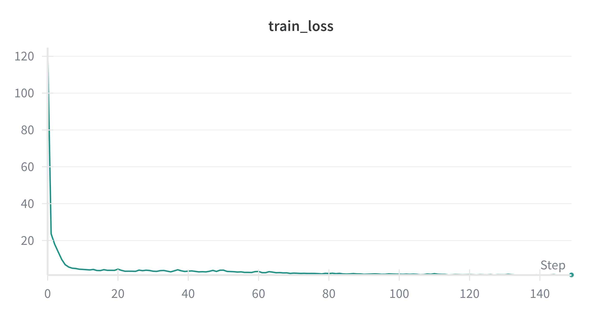
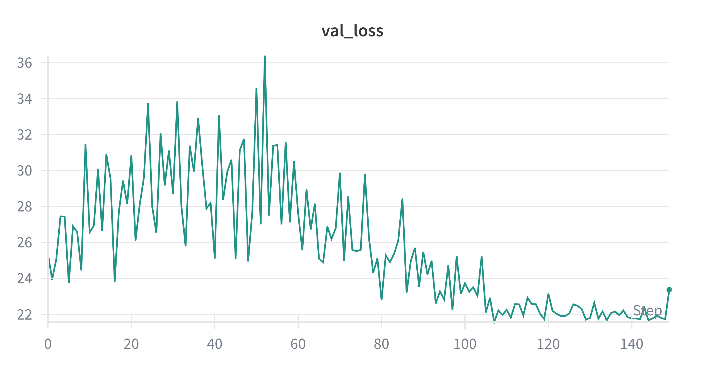
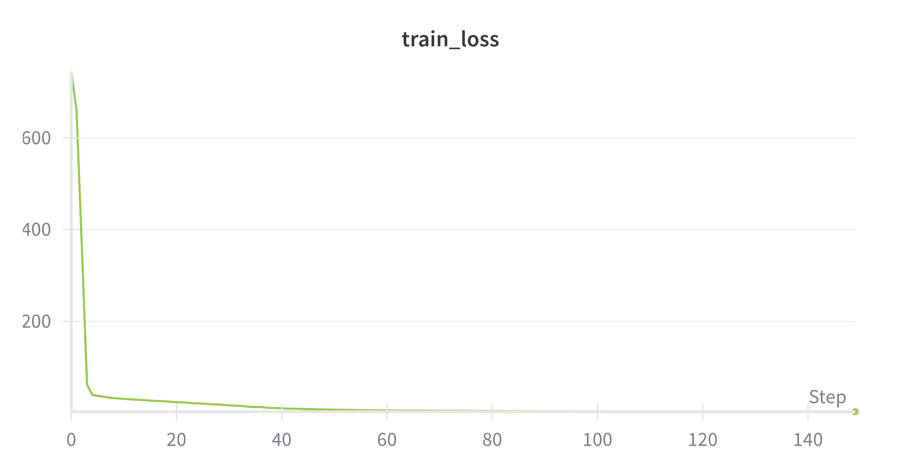
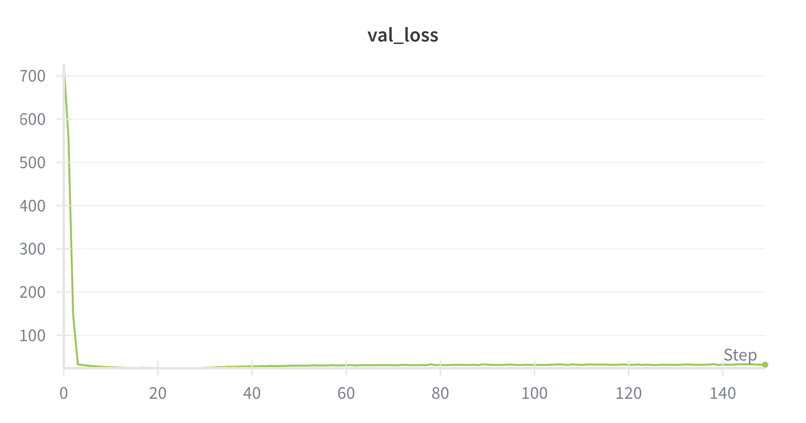
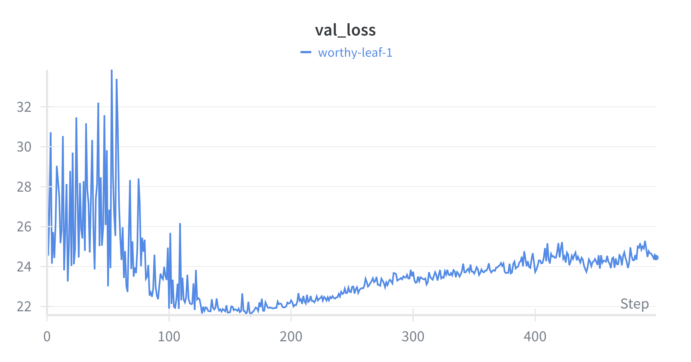
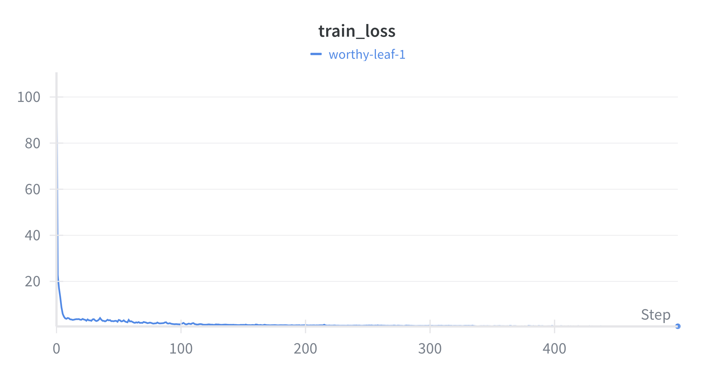
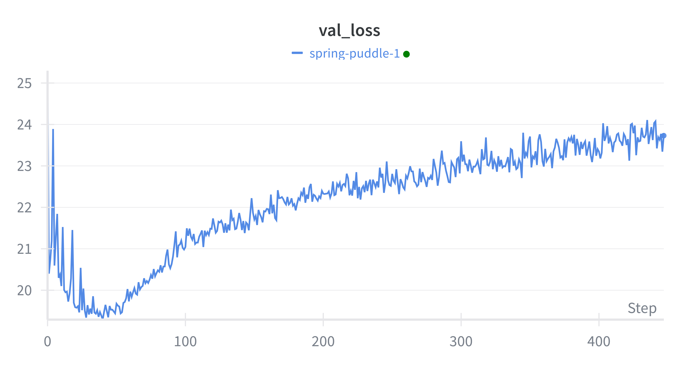
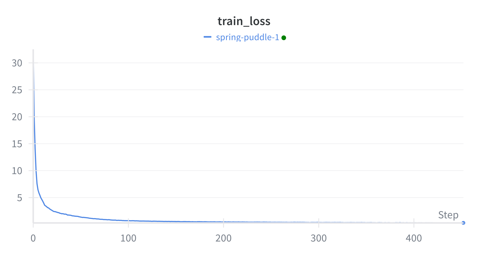

#+setupfile: ~/.emacs.d/latex.org
#+title: Lab 8

The code is stored on GitHub.
[[https://github.com/adsfibonacci/bioinf595_structural_biology/tree/master/lab8]]

Some of the hyperparameter trials were not good, as seen in the last trial

However, convergence was observed since some trials had smooth training and validation curves.

I noticed if the dropout and learning rates was too high, it would lose the smoothness and become significantly more jagged.
The best trial was
#+begin_export
Best trial:
{'hidden_dim': 2048, 'n_layers': 5, 'batch_size': 128, 'learning_rate': 3e-4, 'dropout': 0.23213097511521028}
Best val loss: 21.651360869407654
#+end_export
The biggest effect on the jaggedness of the curves was dropout.
Next time I will implement early stopping so the trials can terminate in fewer epochs and not overfit the models.
I would also increase the optuna trials from 75 to 150 to get better validation curves. 

The best parameters on the small dataset are as follows. 

The best parameters on the medium dataset are as follows.

In both of these, early stopping would have benefitted the model since there is overfitting.

