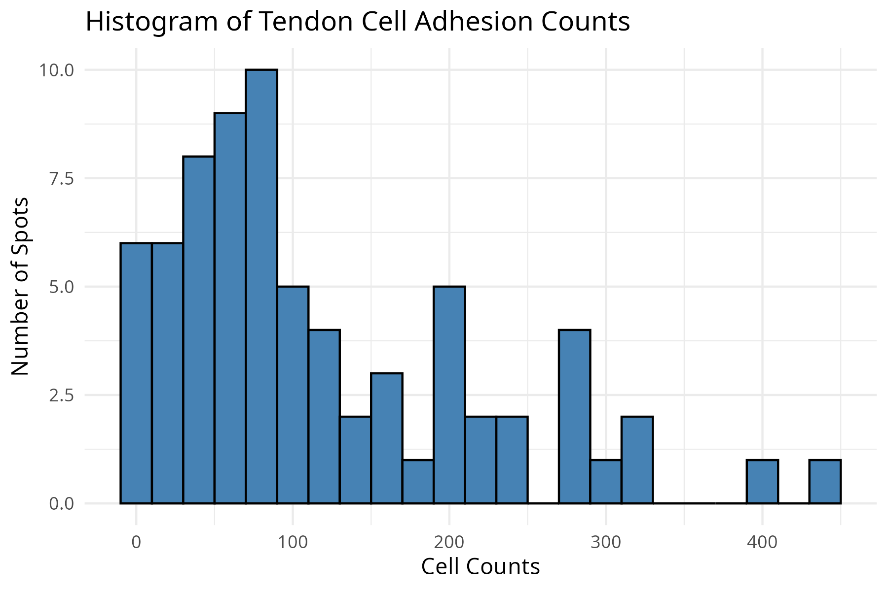
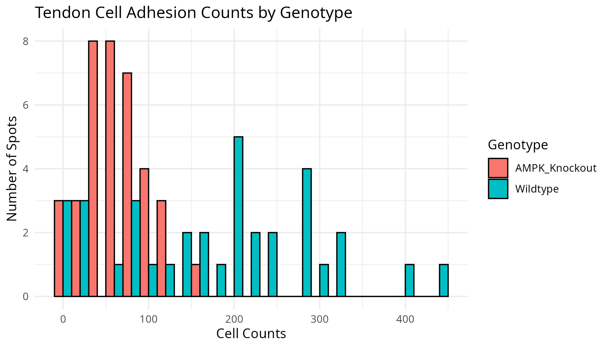
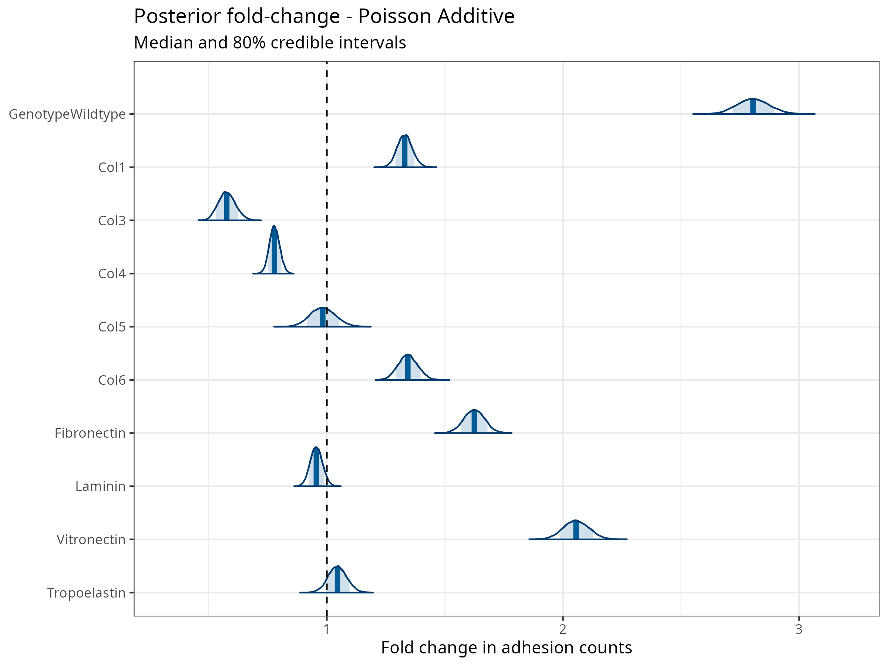
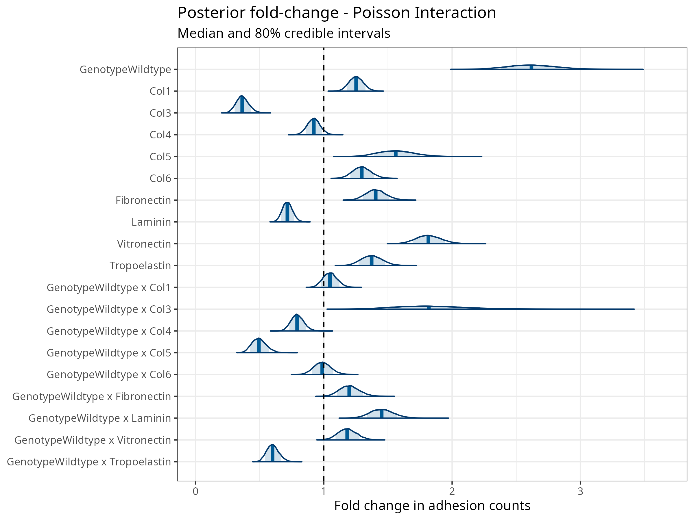
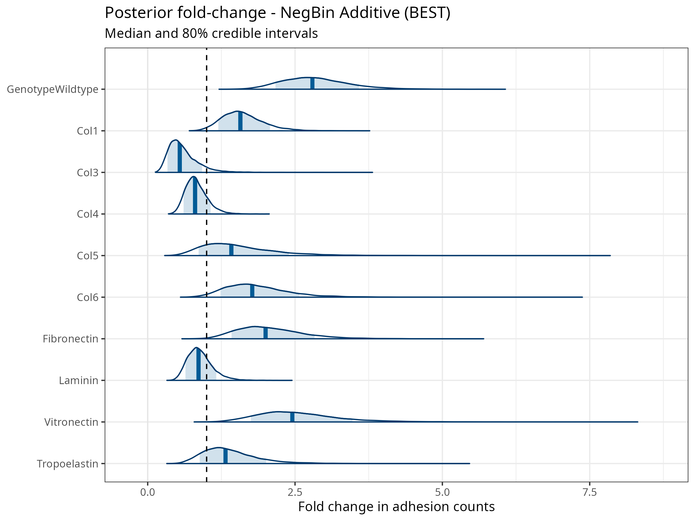
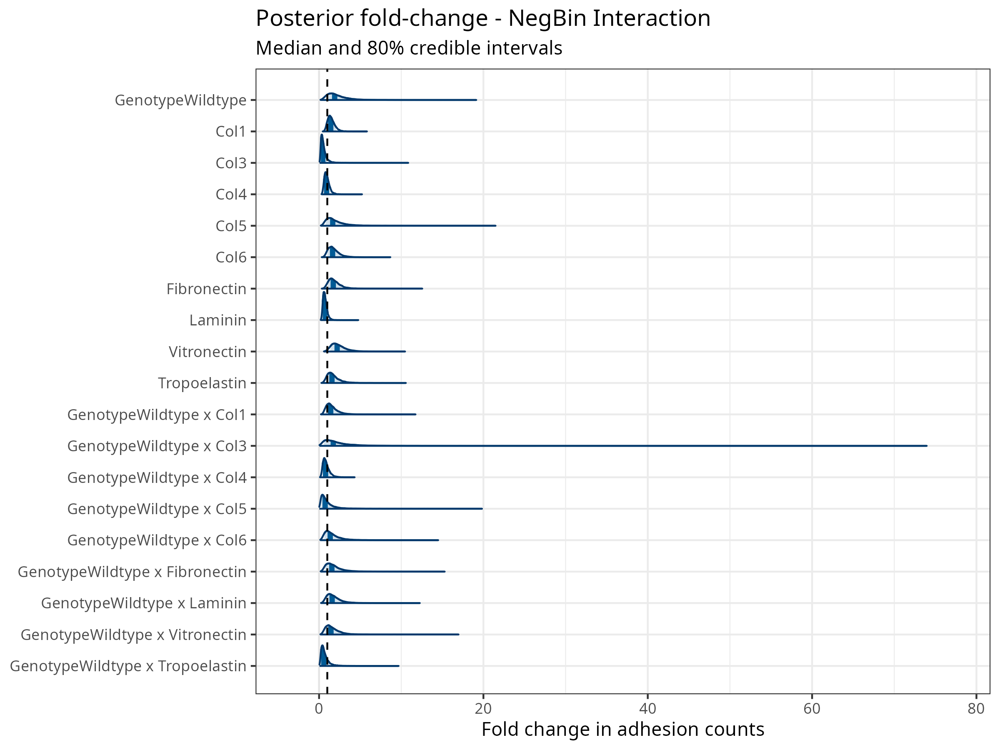

#+setupfile: ~/.emacs.d/latex.org
#+property: header-args:R :results output :exports code :eval no :session *R*

* Installation
#+begin_src R :results none :eval no
  install.packages("igraph")
  install.packages("threejs")
  install.packages(
    "cmdstanr",
    repos = c("https://stan-dev.r-universe.dev", getOption("repos"))
  )
  library(cmdstanr)
  cmdstanr::install_cmdstan()

  install.packages(c("brms", "loo", "posterior", "bayesplot", "shinystan",
                     "readxl", "readr", "ggplot2", "gginnards"))

  # Confirm toolchain
  file <- file.path(cmdstanr::cmdstan_path(), "examples", "bernoulli", "bernoulli.stan")
  mod  <- cmdstan_model(file)
#+end_src

\newpage
* Setup
#+begin_src R :results none
  library(readxl)
  library(ggplot2)
  library(brms)
  library(loo)
  library(readr)
  library(gginnards)
  library(posterior)
  library(bayesplot)
  library(dplyr)
  library(stringr)

  options(brms.backend = "cmdstanr")
  options(mc.cores = parallel::detectCores())

  setwd("/home/alex/Documents/structural_biology/lab9")
  if (!dir.exists("product")) dir.create("product")

  # ── Data ──────────────────────────────────────────────────────────────────────
  FILE_PATH <- "data/ECM_Array_188_189_Stardist_Nuclear_Count_2023-01-03.xlsx"
  adhesion_data <- read_excel(FILE_PATH, sheet = 2)
  adhesion_data$Genotype <- factor(adhesion_data$Genotype,
                                   levels = c(0, 1),
                                   labels = c("AMPK_Knockout", "Wildtype"))

  # ── Shared model building blocks ──────────────────────────────────────────────
  ECM_VARS <- c("Col1", "Col3", "Col4", "Col5", "Col6",
                "Fibronectin", "Laminin", "Vitronectin", "Tropoelastin")

  base_formula        <- as.formula(paste("Counts ~ Genotype +",
                                          paste(ECM_VARS, collapse = " + ")))
  interaction_formula <- as.formula(paste("Counts ~ Genotype * (",
                                          paste(ECM_VARS, collapse = " + "), ")"))

  # Shared priors
  prior_main <- c(
    prior(normal(4.5, 3), class = "Intercept"),
    prior(normal(0,   3), class = "b")
  )

  prior_nb <- c(
    prior(normal(4.5, 3),        class = "Intercept"),
    prior(normal(0,   3),        class = "b"),
    prior(inv_gamma(0.4, 0.3),   class = "shape", lb = 0)
  )

  MCMC_ARGS <- list(chains = 4, iter = 4000, warmup = 1000, thin = 1, seed = 123, silent=2, refresh=0)
#+end_src

\newpage
* Inspect Data
#+begin_src R
  summary(adhesion_data)

  # ── Overall histogram ─────────────────────────────────────────────────────────
  hist_plot <- ggplot(adhesion_data, aes(x = Counts)) +
    geom_histogram(binwidth = 20, fill = "steelblue", color = "black") +
    theme_minimal() +
    labs(title = "Histogram of Tendon Cell Adhesion Counts",
         x = "Cell Counts", y = "Number of Spots")

  print(hist_plot)
  ggsave("product/adhesion_histogram.png", hist_plot, width = 6, height = 4, dpi = 300)

  # ── Histogram by genotype ─────────────────────────────────────────────────────
  hist_genotype_plot <- ggplot(adhesion_data, aes(x = Counts, fill = Genotype)) +
    geom_histogram(binwidth = 20, position = "dodge", color = "black") +
    theme_minimal() +
    labs(title = "Tendon Cell Adhesion Counts by Genotype",
         x = "Cell Counts", y = "Number of Spots", fill = "Genotype")

  print(hist_genotype_plot)
  ggsave("product/adhesion_histogram_by_genotype.png",
         hist_genotype_plot, width = 7, height = 4, dpi = 300)
#+end_src

#+RESULTS:
#+begin_example
     Counts               Genotype       Col1             Col3              Col4       
 Min.   :  0.0   AMPK_Knockout:37   Min.   :0.0000   Min.   :0.00000   Min.   :0.0000  
 1st Qu.: 47.0   Wildtype     :35   1st Qu.:0.0000   1st Qu.:0.00000   1st Qu.:0.0000  
 Median : 83.5                      Median :0.0000   Median :0.00000   Median :0.0000  
 Mean   :118.1                      Mean   :0.3611   Mean   :0.08333   Mean   :0.2778  
 3rd Qu.:184.5                      3rd Qu.:1.0000   3rd Qu.:0.00000   3rd Qu.:1.0000  
 Max.   :443.0                      Max.   :1.0000   Max.   :1.00000   Max.   :1.0000  
      Col5              Col6         Fibronectin      Laminin        Vitronectin      Tropoelastin   
 Min.   :0.00000   Min.   :0.0000   Min.   :0.00   Min.   :0.0000   Min.   :0.0000   Min.   :0.0000  
 1st Qu.:0.00000   1st Qu.:0.0000   1st Qu.:0.00   1st Qu.:0.0000   1st Qu.:0.0000   1st Qu.:0.0000  
 Median :0.00000   Median :0.0000   Median :0.00   Median :0.0000   Median :0.0000   Median :0.0000  
 Mean   :0.08333   Mean   :0.1944   Mean   :0.25   Mean   :0.2778   Mean   :0.2222   Mean   :0.1389  
 3rd Qu.:0.00000   3rd Qu.:0.0000   3rd Qu.:0.25   3rd Qu.:1.0000   3rd Qu.:0.0000   3rd Qu.:0.0000  
 Max.   :1.00000   Max.   :1.0000   Max.   :1.00   Max.   :1.0000   Max.   :1.0000   Max.   :1.0000
#+end_example

#+attr_latex: :width 0.4\textwidth

#+attr_latex: :width 0.4\textwidth

\newpage
* Bayesian Regression
** Model 1 — Poisson, Additive
#+begin_src R
  model1 <- do.call(brm, c(
    list(formula = base_formula,
         data    = adhesion_data,
         family  = poisson(),
         prior   = prior_main),
    MCMC_ARGS
  ))

  # Inspect Stan code and priors
  model1$model
  prior_summary(model1)

  summary(model1)   # check Rhat ≈ 1, ESS > 1000
#+end_src

#+RESULTS:
#+begin_example
// generated with brms 2.23.0
functions {
}
data {
  int<lower=1> N;  // total number of observations
  array[N] int Y;  // response variable
  int<lower=1> K;  // number of population-level effects
  matrix[N, K] X;  // population-level design matrix
  int<lower=1> Kc;  // number of population-level effects after centering
  int prior_only;  // should the likelihood be ignored?
}
transformed data {
  matrix[N, Kc] Xc;  // centered version of X without an intercept
  vector[Kc] means_X;  // column means of X before centering
  for (i in 2:K) {
    means_X[i - 1] = mean(X[, i]);
    Xc[, i - 1] = X[, i] - means_X[i - 1];
  }
}
parameters {
  vector[Kc] b;  // regression coefficients
  real Intercept;  // temporary intercept for centered predictors
}
transformed parameters {
  // prior contributions to the log posterior
  real lprior = 0;
  lprior += normal_lpdf(b | 0, 3);
  lprior += normal_lpdf(Intercept | 4.5, 3);
}
model {
  // likelihood including constants
  if (!prior_only) {
    target += poisson_log_glm_lpmf(Y | Xc, Intercept, b);
  }
  // priors including constants
  target += lprior;
}
generated quantities {
  // actual population-level intercept
  real b_Intercept = Intercept - dot_product(means_X, b);
}
prior     class             coef group resp dpar nlpar lb ub tag       source
   normal(0, 3)         b                                                          user
   normal(0, 3)         b             Col1                                 (vectorized)
   normal(0, 3)         b             Col3                                 (vectorized)
   normal(0, 3)         b             Col4                                 (vectorized)
   normal(0, 3)         b             Col5                                 (vectorized)
   normal(0, 3)         b             Col6                                 (vectorized)
   normal(0, 3)         b      Fibronectin                                 (vectorized)
   normal(0, 3)         b GenotypeWildtype                                 (vectorized)
   normal(0, 3)         b          Laminin                                 (vectorized)
   normal(0, 3)         b     Tropoelastin                                 (vectorized)
   normal(0, 3)         b      Vitronectin                                 (vectorized)
 normal(4.5, 3) Intercept                                                          user
Family: poisson 
  Links: mu = log 
Formula: Counts ~ Genotype + Col1 + Col3 + Col4 + Col5 + Col6 + Fibronectin + Laminin + Vitronectin + Tropoelastin 
   Data: structure(list(Counts = c(99, 11, 1, 76, 275, 443, (Number of observations: 72) 
  Draws: 4 chains, each with iter = 4000; warmup = 1000; thin = 1;
         total post-warmup draws = 12000

Regression Coefficients:
                 Estimate Est.Error l-95% CI u-95% CI Rhat Bulk_ESS Tail_ESS
Intercept            3.74      0.04     3.66     3.81 1.00     8139     8355
GenotypeWildtype     1.03      0.02     0.98     1.08 1.00    16239    10521
Col1                 0.29      0.02     0.24     0.33 1.00    17191     9159
Col3                -0.55      0.06    -0.67    -0.43 1.00    16862     9637
Col4                -0.25      0.03    -0.31    -0.20 1.00    16162     9907
Col5                -0.02      0.05    -0.13     0.09 1.00    14576     9719
Col6                 0.29      0.03     0.24     0.35 1.00    12130     9695
Fibronectin          0.48      0.03     0.43     0.54 1.00    11969     9403
Laminin             -0.05      0.03    -0.10     0.01 1.00    16040     9172
Vitronectin          0.72      0.03     0.67     0.77 1.00    11898    10088
Tropoelastin         0.04      0.04    -0.03     0.12 1.00    12429     9424

Draws were sampled using sample(hmc). For each parameter, Bulk_ESS
and Tail_ESS are effective sample size measures, and Rhat is the potential
scale reduction factor on split chains (at convergence, Rhat = 1).
#+end_example

** Model 2 — Poisson, Interaction
#+begin_src R
  model2 <- do.call(brm, c(
    list(formula = interaction_formula,
         data    = adhesion_data,
         family  = poisson(),
         prior   = prior_main),
    MCMC_ARGS
  ))

  summary(model2)
#+end_src

#+RESULTS:
#+begin_example
Family: poisson 
  Links: mu = log 
Formula: Counts ~ Genotype * (Col1 + Col3 + Col4 + Col5 + Col6 + Fibronectin + Laminin + Vitronectin + Tropoelastin) 
   Data: structure(list(Counts = c(99, 11, 1, 76, 275, 443, (Number of observations: 72) 
  Draws: 4 chains, each with iter = 4000; warmup = 1000; thin = 1;
         total post-warmup draws = 12000

Regression Coefficients:
                              Estimate Est.Error l-95% CI u-95% CI Rhat Bulk_ESS Tail_ESS
Intercept                         3.81      0.06     3.69     3.93 1.00     6042     7415
GenotypeWildtype                  0.96      0.07     0.82     1.11 1.00     5874     7424
Col1                              0.22      0.04     0.14     0.31 1.00    10825     8596
Col3                             -1.01      0.14    -1.29    -0.75 1.00    10543     8411
Col4                             -0.08      0.05    -0.19     0.02 1.00     9392     7850
Col5                              0.44      0.09     0.27     0.62 1.00     7860     8777
Col6                              0.26      0.05     0.15     0.37 1.00     9257     9659
Fibronectin                       0.34      0.06     0.23     0.45 1.00     8831     9091
Laminin                          -0.33      0.06    -0.45    -0.22 1.00    10470     8870
Vitronectin                       0.60      0.05     0.49     0.70 1.00     8183     8629
Tropoelastin                      0.32      0.06     0.20     0.43 1.00     9359     8947
GenotypeWildtype:Col1             0.05      0.05    -0.06     0.15 1.00    10713     9018
GenotypeWildtype:Col3             0.60      0.15     0.31     0.91 1.00    10464     9073
GenotypeWildtype:Col4            -0.23      0.06    -0.35    -0.11 1.00     9478     8318
GenotypeWildtype:Col5            -0.71      0.11    -0.93    -0.49 1.00     8154     8590
GenotypeWildtype:Col6            -0.01      0.07    -0.14     0.12 1.00     8920     9670
GenotypeWildtype:Fibronectin      0.18      0.06     0.06     0.31 1.00     8377     9076
GenotypeWildtype:Laminin          0.37      0.06     0.24     0.50 1.00    10268     9201
GenotypeWildtype:Vitronectin      0.17      0.06     0.04     0.29 1.00     7885     8968
GenotypeWildtype:Tropoelastin    -0.51      0.08    -0.66    -0.35 1.00     9636     9582

Draws were sampled using sample(hmc). For each parameter, Bulk_ESS
and Tail_ESS are effective sample size measures, and Rhat is the potential
scale reduction factor on split chains (at convergence, Rhat = 1).
#+end_example

** Model 3 — Negative Binomial, Additive
#+begin_src R
  model3 <- do.call(brm, c(
    list(formula = base_formula,
         data    = adhesion_data,
         family  = negbinomial(),
         prior   = prior_nb),
    MCMC_ARGS
  ))

  summary(model3)
#+end_src

#+RESULTS:
#+begin_example
Family: negbinomial 
  Links: mu = log 
Formula: Counts ~ Genotype + Col1 + Col3 + Col4 + Col5 + Col6 + Fibronectin + Laminin + Vitronectin + Tropoelastin 
   Data: structure(list(Counts = c(99, 11, 1, 76, 275, 443, (Number of observations: 72) 
  Draws: 4 chains, each with iter = 4000; warmup = 1000; thin = 1;
         total post-warmup draws = 12000

Regression Coefficients:
                 Estimate Est.Error l-95% CI u-95% CI Rhat Bulk_ESS Tail_ESS
Intercept            3.52      0.30     2.94     4.12 1.00     6647     7633
GenotypeWildtype     1.03      0.20     0.64     1.41 1.00    17222     9011
Col1                 0.45      0.22     0.03     0.88 1.00    12533     9735
Col3                -0.60      0.40    -1.35     0.21 1.00    12300     9341
Col4                -0.22      0.22    -0.65     0.23 1.00    14310     9161
Col5                 0.36      0.40    -0.40     1.15 1.00    10554     9546
Col6                 0.58      0.29     0.01     1.16 1.00     9568     9297
Fibronectin          0.70      0.27     0.18     1.22 1.00     9660     9333
Laminin             -0.15      0.23    -0.60     0.32 1.00    13208     9143
Vitronectin          0.90      0.27     0.37     1.45 1.00     9790     9557
Tropoelastin         0.28      0.32    -0.35     0.95 1.00    10397     9022

Further Distributional Parameters:
      Estimate Est.Error l-95% CI u-95% CI Rhat Bulk_ESS Tail_ESS
shape     1.65      0.30     1.14     2.29 1.00    12024     9152

Draws were sampled using sample(hmc). For each parameter, Bulk_ESS
and Tail_ESS are effective sample size measures, and Rhat is the potential
scale reduction factor on split chains (at convergence, Rhat = 1).
#+end_example

** Model 4 — Negative Binomial, Interaction
#+begin_src R
  model4 <- do.call(brm, c(
    list(formula = interaction_formula,
         data    = adhesion_data,
         family  = negbinomial(),
         prior   = prior_nb),
    MCMC_ARGS
  ))

  summary(model4)
#+end_src

#+RESULTS:
#+begin_example
Family: negbinomial 
  Links: mu = log 
Formula: Counts ~ Genotype * (Col1 + Col3 + Col4 + Col5 + Col6 + Fibronectin + Laminin + Vitronectin + Tropoelastin) 
   Data: structure(list(Counts = c(99, 11, 1, 76, 275, 443, (Number of observations: 72) 
  Draws: 4 chains, each with iter = 4000; warmup = 1000; thin = 1;
         total post-warmup draws = 12000

Regression Coefficients:
                              Estimate Est.Error l-95% CI u-95% CI Rhat Bulk_ESS Tail_ESS
Intercept                         3.65      0.39     2.90     4.46 1.00     5698     5982
GenotypeWildtype                  0.64      0.58    -0.52     1.77 1.00     4755     6552
Col1                              0.35      0.29    -0.22     0.93 1.00    10733     9289
Col3                             -0.77      0.59    -1.87     0.45 1.00     8335     8103
Col4                             -0.10      0.33    -0.73     0.57 1.00     9761     8925
Col5                              0.53      0.58    -0.54     1.73 1.00     8280     8522
Col6                              0.50      0.39    -0.24     1.27 1.00     7903     8480
Fibronectin                       0.55      0.39    -0.20     1.34 1.00     8230     8489
Laminin                          -0.38      0.34    -1.05     0.30 1.00     9889     9045
Vitronectin                       0.80      0.38     0.06     1.57 1.00     7665     8725
Tropoelastin                      0.46      0.43    -0.37     1.33 1.00     8283     8590
GenotypeWildtype:Col1             0.36      0.45    -0.52     1.26 1.00     9034     8696
GenotypeWildtype:Col3             0.53      0.81    -1.07     2.11 1.00     8546     8412
GenotypeWildtype:Col4            -0.24      0.46    -1.14     0.69 1.00     9415     8697
GenotypeWildtype:Col5            -0.30      0.82    -1.90     1.35 1.00     7998     8584
GenotypeWildtype:Col6             0.31      0.60    -0.85     1.52 1.00     6518     8748
GenotypeWildtype:Fibronectin      0.43      0.55    -0.65     1.51 1.00     6964     8333
GenotypeWildtype:Laminin          0.46      0.48    -0.47     1.41 1.00     9163     8672
GenotypeWildtype:Vitronectin      0.37      0.54    -0.69     1.43 1.00     7175     7741
GenotypeWildtype:Tropoelastin    -0.56      0.66    -1.85     0.78 1.00     8224     8413

Further Distributional Parameters:
      Estimate Est.Error l-95% CI u-95% CI Rhat Bulk_ESS Tail_ESS
shape     1.57      0.29     1.06     2.20 1.00     9205     9175

Draws were sampled using sample(hmc). For each parameter, Bulk_ESS
and Tail_ESS are effective sample size measures, and Rhat is the potential
scale reduction factor on split chains (at convergence, Rhat = 1).
#+end_example

\newpage
* Analysis
** LOO Cross-Validation
#+begin_src R
  options(brms.loo_message=FALSE)
  model1 <- model1 |> brms::add_criterion("loo", reloo = TRUE)
  model2 <- model2 |> brms::add_criterion("loo", reloo = TRUE)
  model3 <- model3 |> brms::add_criterion("loo", reloo = TRUE)
  model4 <- model4 |> brms::add_criterion("loo", reloo = TRUE)

  model_comparison <- loo::loo_compare(list(
    Poisson_Additive      = model1$criteria$loo,
    Poisson_Interaction   = model2$criteria$loo,
    NegBin_Additive       = model3$criteria$loo,
    NegBin_Interaction    = model4$criteria$loo
  ))

  print(model_comparison)

  model_comparison |>
    as.data.frame() |>
    readr::write_tsv("product/model_comparison_loo.tsv")
#+end_src

#+RESULTS:
: elpd_diff se_diff
: NegBin_Additive         0.0       0.0
: NegBin_Interaction     -7.3       2.9
: Poisson_Additive    -1324.5     258.5
: Poisson_Interaction -1403.9     290.8

** Hypothesis Tests
#+begin_src R
  # Test whether each ECM protein has a positive effect on adhesion
  # using the best-fitting model (update label below after model comparison)
  best_model <- model3   # update after inspecting model_comparison

  best_model |> brms::hypothesis(c(
    "Col1         > 0",
    "Col3         > 0",
    "Col4         > 0",
    "Col5         > 0",
    "Col6         > 0",
    "Fibronectin  > 0",
    "Laminin      > 0",
    "Vitronectin  > 0",
    "Tropoelastin > 0",
    "GenotypeWildtype > 0"
  ))
#+end_src

#+RESULTS:
#+begin_example
Hypothesis Tests for class b:
               Hypothesis Estimate Est.Error CI.Lower CI.Upper Evid.Ratio Post.Prob Star
1              (Col1) > 0     0.45      0.22     0.10     0.81      55.34      0.98    *
2              (Col3) > 0    -0.60      0.40    -1.23     0.06       0.07      0.07     
3              (Col4) > 0    -0.22      0.22    -0.58     0.16       0.20      0.16     
4              (Col5) > 0     0.36      0.40    -0.28     1.03       4.44      0.82     
5              (Col6) > 0     0.58      0.29     0.11     1.05      42.64      0.98    *
6       (Fibronectin) > 0     0.70      0.27     0.26     1.14     225.42      1.00    *
7           (Laminin) > 0    -0.15      0.23    -0.53     0.24       0.35      0.26     
8       (Vitronectin) > 0     0.90      0.27     0.46     1.35    1999.00      1.00    *
9      (Tropoelastin) > 0     0.28      0.32    -0.24     0.83       4.27      0.81     
10 (GenotypeWildtype) > 0     1.03      0.20     0.70     1.35        Inf      1.00    *
---
'CI': 90%-CI for one-sided and 95%-CI for two-sided hypotheses.
'*': For one-sided hypotheses, the posterior probability exceeds 95%;
for two-sided hypotheses, the value tested against lies outside the 95%-CI.
Posterior probabilities of point hypotheses assume equal prior probabilities.
#+end_example

** Posterior Plots
#+begin_src R
  make_posterior_plot <- function(model, title_label) {

    # Extract posterior draws
    draws <- posterior::as_draws_df(model)
    
    # Keep fixed effects only
    draws_b <- draws |>
      dplyr::select(dplyr::starts_with("b_")) |>
      dplyr::select(-dplyr::contains("Intercept")) |>
      as.matrix()   # <- prevents draws_df warning

    # Log-coefs → fold change
    draws_fc <- exp(draws_b)

    # Clean names
    colnames(draws_fc) <- colnames(draws_fc) |>
      stringr::str_remove("^b_") |>
      stringr::str_replace_all(":", " x ")

    # Plot
    p <- bayesplot::mcmc_areas(
          draws_fc,
          prob = 0.8
        ) +
        ggplot2::theme_bw() +
        ggplot2::ggtitle(
          paste0("Posterior fold-change - ", title_label),
          subtitle = "Median and 80% credible intervals"
        ) +
        ggplot2::geom_vline(xintercept = 1, linetype = "dashed") +
        ggplot2::xlab("Fold change in adhesion counts")

    return(p)
  }

  p1 <- make_posterior_plot(model1, "Poisson Additive")
  p2 <- make_posterior_plot(model2, "Poisson Interaction")
  p3 <- make_posterior_plot(model3, "NegBin Additive (BEST)")
  p4 <- make_posterior_plot(model4, "NegBin Interaction")

  print(p1); print(p2); print(p3); print(p4)

  ggsave("product/posterior_poisson_additive.png",    p1, width = 8, height = 6, dpi = 300)
  ggsave("product/posterior_poisson_interaction.png", p2, width = 8, height = 6, dpi = 300)
  ggsave("product/posterior_negbin_additive.png",     p3, width = 8, height = 6, dpi = 300)
  ggsave("product/posterior_negbin_interaction.png",  p4, width = 8, height = 6, dpi = 300)
#+end_src

#+RESULTS:
: Warning message:
: Dropping 'draws_df' class as required metadata was removed.
: Warning message:
: Dropping 'draws_df' class as required metadata was removed.
: Warning message:
: Dropping 'draws_df' class as required metadata was removed.
: Warning message:
: Dropping 'draws_df' class as required metadata was removed.
\newpage
#+attr_latex: :width 0.4\textwidth

#+attr_latex: :width 0.4\textwidth

#+attr_latex: :width 0.4\textwidth

#+attr_latex: :width 0.4\textwidth

\newpage
** Interactive Diagnostics
#+begin_src R :exports code :results none
  # Launch ShinyStan for detailed MCMC diagnostics.
  # Explore DIAGNOSE (divergences, Rhat, ESS),
  # ESTIMATE (parameter posteriors), and EXPLORE (pairs plots).
  options(browser="firefox")
  shinystan::launch_shinystan(model1)
  shinystan::launch_shinystan(model2)  
  shinystan::launch_shinystan(model3)
  shinystan::launch_shinystan(model4)  
#+end_src

* Assignment Responses
** Q1: Which model fits best?
#+begin_export latex
Model fit was assessed using leave-one-out cross-validation (LOO).
The expected log predictive density differences were:

\begin{itemize}
\item \textbf{Negative Binomial — Additive}: $\Delta \mathrm{elpd} = 0.0$ (best fit)
\item Negative Binomial — Interaction: $\Delta \mathrm{elpd} = -7.7$ \quad (SE = 3.0)
\item Poisson — Additive: $\Delta \mathrm{elpd} = -1326.4$ \quad (SE = 259.6)
\item Poisson — Interaction: substantially worse than all others
\end{itemize}

\paragraph{Conclusion}
\begin{itemize}
\item The negative binomial family strongly outperforms the Poisson family
($|\Delta \mathrm{elpd}| \gg 2 \times \mathrm{SE}$), indicating substantial
\textbf{overdispersion} in the count data.
\item The additive negative binomial model outperforms the interaction model
by $\sim 7.7$ elpd units ($> 2 \times \mathrm{SE}$), providing
\textbf{no strong evidence} that genotype–ECM interaction terms improve fit.
\item The preferred model is therefore the \textbf{additive negative binomial model}.
\end{itemize}
#+end_export

** Q2: Prior sensitivity
#+begin_export latex
To assess prior sensitivity, the intercept prior was intentionally misspecified
by shifting its mean far from plausible values and tightening its variance.

\paragraph{Observed behavior}
\begin{itemize}
\item With a \textbf{tight, badly misspecified prior}, posterior estimates were
pulled toward the incorrect prior mean.
\item This induced increased posterior uncertainty and occasional sampler pathologies
(e.g., divergences).
\item With a \textbf{wide misspecified prior}, the likelihood dominated and posterior
estimates remained stable.
\end{itemize}

\paragraph{Conclusion}
Model results are robust to weakly informative priors but can degrade under
strong, incorrect prior assumptions.
#+end_export

** Q3: ShinyStan observation
#+begin_export latex
Inspection of MCMC diagnostics showed:

\begin{itemize}
\item All parameters had $\hat{R} < 1.01$, indicating good chain convergence.
\item Effective sample sizes exceeded 1000 for all key parameters.
\item Pairwise posterior plots revealed mild funnel-shaped correlation between
the intercept and dispersion (shape) parameter, which is typical for
negative binomial models.
\end{itemize}

\begin{table}[ht]
\centering
\begin{tabular}{lrrrrrrr}
\toprule
Parameter & $\hat{R}$ & $n_{\mathrm{eff}}$ & Mean & SD & 2.5% & 50% & 97.5% \
\midrule
Intercept & 1.00 & 6625 & 3.5 & 0.3 & 2.9 & 3.5 & 4.1 \
Genotype (Wildtype) & 1.00 & 12000 & 1.0 & 0.2 & 0.6 & 1.0 & 1.4 \
\bottomrule
\end{tabular}
\end{table}

The Explore tab did not change depending on whether the warmup was included or not.
All of the histograms for each variable were normal, which was reflected in the posterior vs transformed raw data seemed to be Gaussian's spreading in a bulbous shape. 
#+end_export

** Q4: Summary of findings
#+begin_export latex
The best-fitting model is a \textbf{negative binomial regression with additive predictors}.
The Poisson assumption is strongly violated, and the estimated dispersion
parameter confirms substantial overdispersion consistent with clustering
in spot-level adhesion counts.

\paragraph{Key posterior findings}
(credible intervals exclude zero)

\begin{itemize}
\item \textbf{Positive effects on adhesion:}
\begin{itemize}
\item Vitronectin ($\sim 2\times$ increase)
\item Fibronectin ($\sim 1.6\times$ increase)
\item Collagen I ($\sim 1.3\times$ increase)
\item Collagen VI ($\sim 1.35\times$ increase)
\end{itemize}

\item \textbf{Negative effects on adhesion:}
\begin{itemize}
\item Collagen III ($\sim 0.6\times$)
\item Collagen IV ($\sim 0.8\times$)
\end{itemize}

\item \textbf{Uncertain / near-zero effects:}
Collagen V, Laminin, Tropoelastin

\item \textbf{Genotype effect:}
Wildtype cells adhere substantially more than AMPK-knockout cells
($\sim 2.8\times$ change on the log scale), supporting a role for AMPK in
regulating cytoskeletal–ECM interactions.
\end{itemize}
#+end_export
