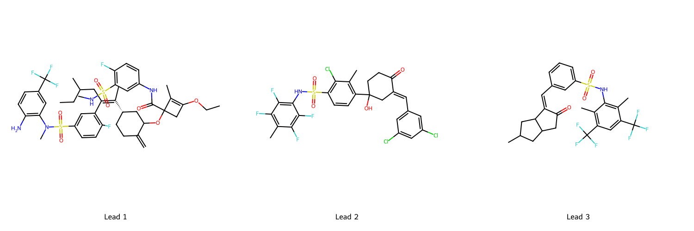
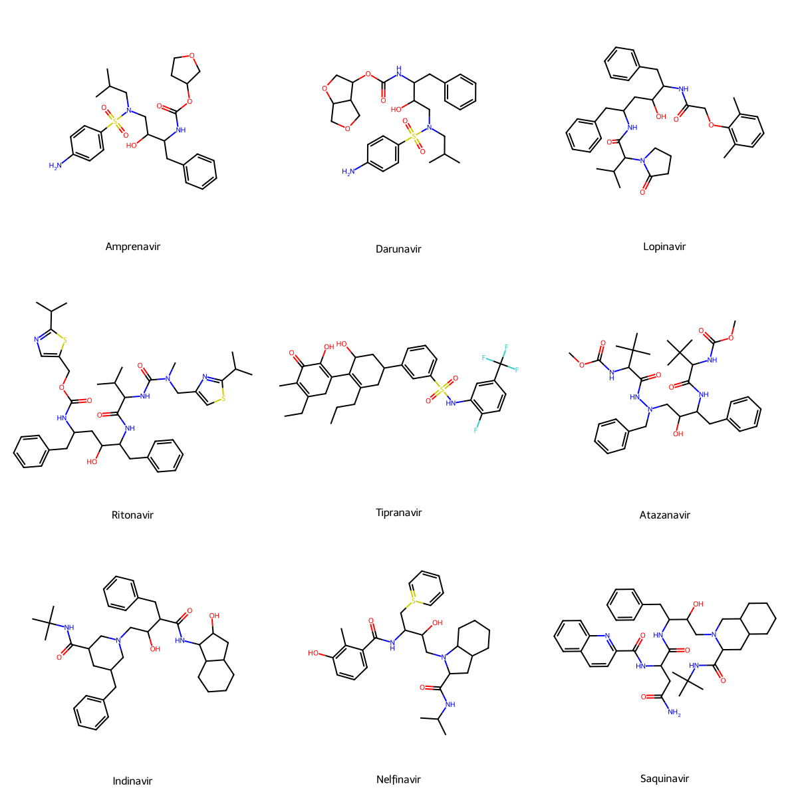

#+setupfile: ~/.emacs.d/latex.org
#+title: HIV-1 Protease Binding 

* Project Abstract

** Problem Statement and Data Sources
Mutations in HIV-1 protease are a primary driver of resistance to clinically important inhibitors, severely limiting long-term treatment efficacy.
A key knowledge gap is how to systematically leverage both structural data and known resistance profiles to design compounds that remain effective across multiple mutant strains.
To address this, I developed a closed-loop computational framework integrating structural modeling over a tree based representation of drug space. 
The foundational data consisted of 214 clinically observed strains of HIV-1 protease sourced from the Stanford HIV Database and the Protein Data Bank (PDB), alongside 9 FDA-approved protease inhibitors (e.g., Ritonavir, Indinavir) which served as the baseline controls for all binding and structural comparisons.

#+begin_export latex
\begin{figure}[ht]
    \centering
    \begin{subfigure}[b]{0.48\textwidth}
        \centering
        \includegraphics[width=\textwidth]{./results/double_single_wt_isometric.png}
        \caption{Isometric View}
    \end{subfigure}
    \hfill
    \begin{subfigure}[b]{0.48\textwidth}
        \centering
        \includegraphics[width=\textwidth]{./results/double_single_wt_highlight.png}
        \caption{Highlighted Variants}
    \end{subfigure}
    \caption{Structural modeling of HIV-1 Protease wild-type and mutant variants.}
    \label{fig:structural_modeling}
\end{figure}
#+end_export

** Computational Setup and Approach
Our approach inverted the traditional drug-discovery pipeline by optimizing ligands against an adversarial panel of resistant protein variants. 
- *Variant Panel Generation:* PyRosetta was used to generate an artificial screening panel of protein variants by introducing all possible amino acid changes resulting from single-nucleotide mutations in the protease sequence.
- *Generative Ligand Design:* A Monte Carlo Tree Search (MCTS) algorithm was implemented to explore the chemical space of compound modifications, using the 9 FDA-approved inhibitors as starting seeds. 
- *Validation:* Proposed modifications were rigorously filtered using Synformer to ensure chemical validity, synthetic accessibility, and existence.
- *Reward Function and Scoring:* High-fidelity docking via AutoDock Vina was used to determine the binding affinities of newly generated molecules against a random subset of the PyRosetta-generated mutant panel.

** Results
Evaluating the terminal states of the MCTS generated a robust library of novel candidates.
A UMAP dimensionality reduction of the topological and structural properties of the final compound tree was constructed to map the explored chemical space.
The MCTS started close to the FDA approved drugs and stayed in regions nearby for a few iterations, but eventually began to explore the space significantly more.
The proposed ligands with the highest affinities are far away from the FDA approved ligands, so immediately knowing off target effects is difficult to predict. 

#+begin_export latex
\begin{figure}[ht]
    \centering
    \begin{subfigure}[b]{0.48\textwidth}
        \centering
        \includegraphics[width=\textwidth]{./results/umap_2_fda_labeled.png}
        \caption{FDA Drug Embeddings}
    \end{subfigure}
    \hfill
    \begin{subfigure}[b]{0.48\textwidth}
        \centering
        \includegraphics[width=\textwidth]{./results/umap_3_top_scorers.png}
        \caption{Top Candidate Clusters}
    \end{subfigure}
    \caption{UMAP visualization comparing known FDA inhibitors to MCTS-derived candidates.}
    \label{fig:umap_comparison}
\end{figure}
#+end_export

A more comprehensive list of the discovered ligands is here [[https://github.com/adsfibonacci/bioinf595_structural_biology/tree/master/project]] under the results folder. 

#+caption: Vina docking scores for top-performing broad-spectrum candidates.
#+name: tab:smiles_scores
#+attr_latex: :font \scriptsize :align |p{15cm}|l|
| SMILES                                                                            |            Score |
|-----------------------------------------------------------------------------------+------------------|
| C=C1CCC@HCC1OC1(C(=O)Nc2ccc(F)c(S(=O)(=O)NC)c2)CC(OCC)=C1C                        |            10.79 |
| Cc1c(F)c(F)c(NS(=O)(=O)c2ccc(C3(O)CCC(=O)C(=Cc4cc(Cl)cc(Cl)c4)C3)c(C)c2Cl)c(F)c1F |            10.35 |
| Cc1c(C(F)(F)F)cc(C(F)(F)F)c(C)c1NS(=O)(=O)c1cccc(C=C2C(=O)CC3CC(C)CC23)c1         | 10.0285714285714 |
| Cc1cc(Cl)c(C2(O)CCC(=O)C(=Cc3cccc(O)c3)C2)cc1S(=O)(=O)Nc1c(O)c(Cl)cc(C)c1F        |            10.01 |
| NC1=CC(=O)C(=Cc2ccc(F)c(S(=O)(=O)Nc3cc(F)c(F)cc3NC3=CC(=O)CCC3)c2)CC1             |             9.99 |
| Cc1c(C2(O)CCC(=O)C(=Cc3cccc(Cl)c3)C2)ccc(S(=O)(=O)Nc2c(F)c(F)c(C)c(F)c2F)c1C      |             9.95 |
| CCOC1=C(C)C(O[C@H]2CC@@HCC(C(C)CC)=C2C)(C(=O)Nc2cccc(S(=O)(=O)Nc3ccccc3F)c2)C1    |             9.89 |
| Cc1ccc(C=C2CC3(C)CC(=O)CC(C)(C2)C3)cc1S(=O)(=O)Nc1c(C)c(C(F)(F)F)cc(C(F)(F)F)c1C  |             9.87 |
| Cc1cc(C2(O)CCC(=O)C(=Cc3cccc(C=O)c3)C2)ccc1S(=O)(=O)Nc1c(F)c(F)c(C)c(F)c1F        |             9.87 |
| Cc1cccc(N(c2cc(C)c(F)cc2F)c2cccc(NC3=CC(=O)C(=Cc4ccc(F)c(F)c4)CC3)c2C)c1          |             9.86 |

#+caption: 2D Chemical depictions of the top high-affinity lead molecules.
#+attr_latex: :width 0.8\textwidth :center t

A set of ligands that are representative of many of the top 50 binders conserved the SO_2 center and highly florination side chains.
This is expected, as these groups appeared in the predetermined drugs already. 
#+begin_export latex
\begin{figure}[ht]
    \centering
    \begin{subfigure}[b]{0.3\textwidth}
        \centering
        \includegraphics[width=\textwidth]{./results/images/rank_12.png}
    \end{subfigure}
    \hfill
    \begin{subfigure}[b]{0.3\textwidth}
        \centering
        \includegraphics[width=\textwidth]{./results/images/rank_17.png}
    \end{subfigure}
    \hfill
    \begin{subfigure}[b]{0.3\textwidth}
        \centering
        \includegraphics[width=\textwidth]{./results/images/rank_40.png}
    \end{subfigure}
    \caption{Representative structures with common motifs}
    \label{fig:representation}
\end{figure}
#+end_export

These bindings all have a binding affinity under -9kcal/mol, which ranges between 3 and 4 less than the FDA approved drugs, which have bindings between -6 and -7 kcal/mol.

#+name: FDA approved structures
#+caption: FDA approved structures

\newpage
** Interpretation and Impact
While physics based binding scores indicate that these molecules are strong worst case mutant binders, the distance they appear in the UMAP representation suggests there are other qualities about molecular binding to HIV-1 protease than only affinity.
A modification to the proposed framework would be representing the ligands in a latent space and then using decoded steps in the latent space as a newly defined action. Additionally, this needs to be run with a larger physics scoring engine, a larger search space, and a hybrid reward system that extends beyond only binding affinity.
